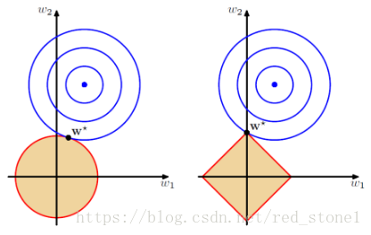

# 正则化

[参考博客地址](https://blog.csdn.net/red_stone1/article/details/80755144)

​	机器学习中，如果参数过多，模型过于复杂，容易造成过拟合(overfit)。即模型在训练样本数据上表现得很好，但在实际测试样本上表现的很差，不具备良好的泛化能力。为了避免过拟合，最常用的一种方法是使用正则化，例如L1和L2正则化。

## L1和L2解的稀疏性

​	以二维情况讨论，上图左边是L2正则化，右边是L1正则化。从另一方面来看，满足正则化条件，实际上是求解蓝色区域与黄色区域的交点，即同时满足限定条件和Ein最小化。对于L2来说，限定区域是圆，这样，得到的解w1或w2的概率很小，很大概率是非零点。

​	对于L1来说，限定区域是正方形，方形与蓝色区域的交点是顶点的概率很大，这从视觉和常识上来看很容易理解的。也就是说，方形的凸点会更接近最优解对应的wlin位置，而凸点处必有w1或w2为0。这样得到的解w1或w2为0的概率就很大了。所以，L1正则化的解具有稀疏性。

​	

