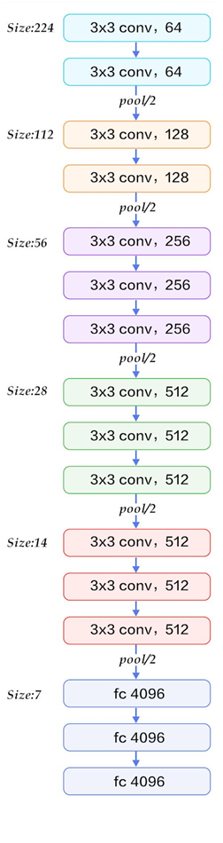

# VGG

**2014年**

[原博客地址=====](https://my.oschina.net/u/876354/blog/1634322)

​	2014年，牛津大学计算机视觉组（Visual Geometry Group）和Google DeepMind公司的研究员一起研发出了新的深度卷积神经网络：VGGNet，并取得了ILSVRC2014比赛分类项目的第二名（第一名是GoogLeNet，也是同年提出的）和定位项目的第一名。

​	VGGNet探索了卷积神经网络的深度与其性能之间的关系，成功地构筑了16~19层深的卷积神经网络，证明了增加网络的深度能够在一定程度上影响网络最终的性能，使错误率大幅下降，同时拓展性又很强，迁移到其它图片数据上的泛化性也非常好。到目前为止，VGG仍然被用来提取图像特征。

## VGG特点

- 结构简洁
  - VGG由5层卷积层、3层全连接层、softmax输出层构成，层与层之间使用max-pooling（最大化池）分开，所有隐层的激活单元都采用ReLU函数。
- 小卷积核和多卷积子层
  - VGG使用多个较小卷积核（3x3）的卷积层代替一个卷积核较大的卷积层，一方面可以减少参数，另一方面相当于进行了更多的非线性映射，可以增加网络的拟合/表达能力。
- 小的池化核
  - 相比AlexNet的3x3的池化核，VGG全部采用2x2的池化核。
- 通道数多
  - VGG网络第一层的通道数为64，后面每层都进行了翻倍，最多到512个通道，通道数的增加，使得更多的信息可以被提取出来。
- 层数更深，特征图更宽
  - 由于卷积核专注于扩大通道数、池化专注于缩小宽和高，使得模型架构上更深更宽的同时，控制了计算量的增加规模。

## VGG网络结构

​	下图是来自论文《Very Deep Convolutional Networks for Large-Scale Image Recognition》（基于甚深层卷积网络的大规模图像识别）的VGG网络结构，正是在这篇论文中提出了VGG，如下图：

​	在这篇论文中分别使用了A、A-LRN、B、C、D、E这6种网络结构进行测试，这6种网络结构相似，都是由5层卷积层、3层全连接层组成，其中区别在于每个卷积层的子层数量不同，从A至E依次增加（子层数量从1到4），总的网络深度从11层到19层（添加的层以粗体显示），表格中的卷积层参数表示为“conv⟨感受野大小⟩-通道数⟩”，例如con3-128，表示使用3x3的卷积核，通道数为128。为了简洁起见，在表格中不显示ReLU激活功能。
其中，网络结构D就是著名的VGG16，网络结构E就是著名的VGG19。

以网络结构D（VGG16）为例，介绍其处理过程如下，请对比上面的表格和下方这张图，留意图中的数字变化，有助于理解VGG16的处理过程：

1、输入224x224x3的图片，经64个3x3的卷积核作两次卷积+ReLU，卷积后的尺寸变为224x224x64 

2、作max pooling（最大化池化），池化单元尺寸为2x2（效果为图像尺寸减半），池化后的尺寸变为112x112x64 

3、经128个3x3的卷积核作两次卷积+ReLU，尺寸变为112x112x128 

4、作2x2的max pooling池化，尺寸变为56x56x128 

5、经256个3x3的卷积核作三次卷积+ReLU，尺寸变为56x56x256 

6、作2x2的max pooling池化，尺寸变为28x28x256

 7、经512个3x3的卷积核作三次卷积+ReLU，尺寸变为28x28x512 

8、作2x2的max pooling池化，尺寸变为14x14x512 

9、经512个3x3的卷积核作三次卷积+ReLU，尺寸变为14x14x512 

10、作2x2的max pooling池化，尺寸变为7x7x512 

11、与两层1x1x4096，一层1x1x1000进行全连接+ReLU（共三层） 

12、通过softmax输出1000个预测结果

​	从上面的过程可以看出VGG网络结构还是挺简洁的，都是由小卷积核、小池化核、ReLU组合而成。其简化图如下（以VGG16为例）：

​	A、A-LRN、B、C、D、E这6种网络结构的深度虽然从11层增加至19层，但参数量变化不大，这是由于基本上都是采用了小卷积核（3x3，只有9个参数），这6种结构的参数数量（百万级）并未发生太大变化，这是因为在网络中，参数主要集中在全连接层。

​	经作者对A、A-LRN、B、C、D、E这6种网络结构进行单尺度的评估，错误率结果如下：

从上表可以看出：
**1、LRN层无性能增益（A-LRN）**
VGG作者通过网络A-LRN发现，AlexNet曾经用到的LRN层（local response normalization，局部响应归一化）并没有带来性能的提升，因此在其它组的网络中均没再出现LRN层。
**2、随着深度增加，分类性能逐渐提高（A、B、C、D、E）**
从11层的A到19层的E，网络深度增加对top1和top5的错误率下降很明显。
**3、多个小卷积核比单个大卷积核性能好（B）**
VGG作者做了实验用B和自己一个不在实验组里的较浅网络比较，较浅网络用conv5x5来代替B的两个conv3x3，结果显示多个小卷积核比单个大卷积核效果要好。

最后进行个小结：
**1、通过增加深度能有效地提升性能；**

**2、最佳模型：VGG16，从头到尾只有3x3卷积与2x2池化，简洁优美；**

**3、卷积可代替全连接，可适应各种尺寸的图片**

