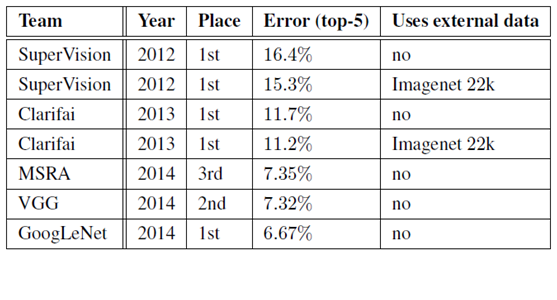
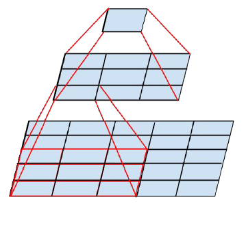
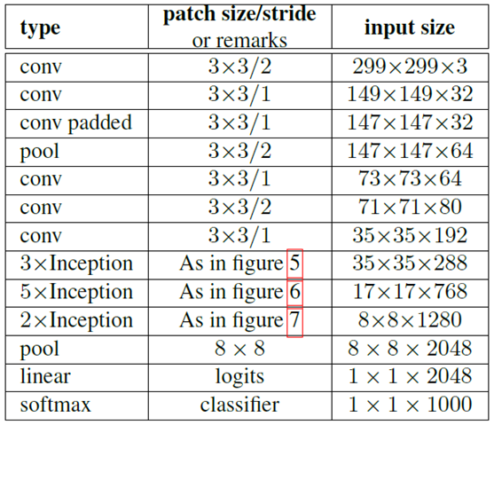
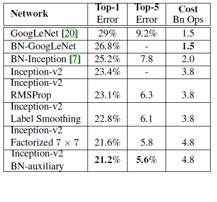

# GoogLeNet

**2014年**

[博客原地址=====](https://my.oschina.net/u/876354/blog/1637819)

​	2014年，GoogLeNet和VGG是当年ImageNet挑战赛(ILSVRC14)的双雄，GoogLeNet获得了第一名、VGG获得了第二名，这两类模型结构的共同特点是层次更深了。VGG继承了LeNet以及AlexNet的一些框架结构（详见  [大话CNN经典模型：VGGNet](https://my.oschina.net/u/876354/blog/1634322)），而GoogLeNet则做了更加大胆的网络结构尝试，虽然深度只有22层，但大小却比AlexNet和VGG小很多，GoogleNet参数为500万个，AlexNet参数个数是GoogleNet的12倍，VGGNet参数又是AlexNet的3倍，因此在内存或计算资源有限时，GoogleNet是比较好的选择；从模型结果来看，GoogLeNet的性能却更加优越。

​	小知识：GoogLeNet是谷歌（Google）研究出来的深度网络结构，为什么不叫“GoogleNet”，而叫“GoogLeNet”，据说是为了向“LeNet”致敬，因此取名为“GoogLeNet”

那么，GoogLeNet是如何进一步提升性能的呢？

​	 一般来说，提升网络性能最直接的办法就是增加网络深度和宽度，深度指网络层次数量、宽度指神经元数量。但这种方式存在以下问题： 

（1）参数太多，如果训练数据集有限，很容易产生过拟合；

 （2）网络越大、参数越多，计算复杂度越大，难以应用； 

（3）网络越深，容易出现梯度弥散问题（梯度越往后穿越容易消失），难以优化模型。

##  什么是Inception呢？

Inception历经了V1、V2、V3、V4等多个版本的发展，不断趋于完善，下面一一进行介绍

### Inception V1

​	通过设计一个稀疏网络结构，但是能够产生稠密的数据，既能增加神经网络表现，又能保证计算资源的使用效率。谷歌提出了最原始Inception的基本结构：

​	该结构将CNN中常用的卷积（1x1，3x3，5x5）、池化操作（3x3）堆叠在一起（卷积、池化后的尺寸相同，将通道相加），一方面增加了网络的宽度，另一方面也增加了网络对尺度的适应性。

​	网络卷积层中的网络能够提取输入的每一个细节信息，同时5x5的滤波器也能够覆盖大部分接受层的的输入。还可以进行一个池化操作，以减少空间大小，降低过度拟合。在这些层之上，在每一个卷积层后都要做一个ReLU操作，以增加网络的非线性特征。 然而这个Inception原始版本，所有的卷积核都在上一层的所有输出上来做，而那个5x5的卷积核所需的计算量就太大了，造成了特征图的厚度很大，为了避免这种情况，在3x3前、5x5前、max pooling后分别加上了1x1的卷积核，以起到了降低特征图厚度的作用，这也就形成了Inception v1的网络结构，如下图所示：

**1x1的卷积核有什么用呢？**

​	 1x1卷积的主要目的是为了减少维度，还用于修正线性激活（ReLU）。比如，上一层的输出为100x100x128，经过具有256个通道的5x5卷积层之后(stride=1，pad=2)，输出数据为100x100x256，其中，卷积层的参数为128x5x5x256= 819200。而假如上一层输出先经过具有32个通道的1x1卷积层，再经过具有256个输出的5x5卷积层，那么输出数据仍为为100x100x256，但卷积参数量已经减少为128x1x1x32 + 32x5x5x256= 204800，大约减少了4倍。

基于Inception构建了GoogLeNet的网络结构如下（共22层）：

对上图说明如下： 

（1）GoogLeNet采用了模块化的结构（Inception结构），方便增添和修改；

 （2）网络最后采用了average pooling（平均池化）来代替全连接层，该想法来自NIN（Network in Network），事实证明这样可以将准确率提高0.6%。但是，实际在最后还是加了一个全连接层，主要是为了方便对输出进行灵活调整； 

（3）虽然移除了全连接，但是网络中依然使用了Dropout ;  

（4）为了避免梯度消失，网络额外增加了2个辅助的softmax用于向前传导梯度（辅助分类器）。辅助分类器是将中间某一层的输出用作分类，并按一个较小的权重（0.3）加到最终分类结果中，这样相当于做了模型融合，同时给网络增加了反向传播的梯度信号，也提供了额外的正则化，对于整个网络的训练很有裨益。而在实际测试的时候，这两个额外的softmax会被去掉。

GoogLeNet的网络结构图细节如下：

注：上表中的“#3x3 reduce”，“#5x5 reduce”表示在3x3，5x5卷积操作之前使用了1x1卷积的数量。

GoogLeNet网络结构明细表解析如下：

 **0、输入** 原始输入图像为224x224x3，且都进行了零均值化的预处理操作（图像每个像素减去均值）。

 **1、第一层（卷积层）**

 使用7x7的卷积核（滑动步长2，padding为3），64通道，输出为112x112x64，卷积后

进行ReLU操作

 经过3x3的max pooling（步长为2），输出为((112 - 3+1)/2)+1=56，即56x56x64，

再进行ReLU操作

 **2、第二层（卷积层）** 

使用3x3的卷积核（滑动步长为1，padding为1），192通道，输出为56x56x192，卷积

后进行ReLU操作 经过3x3的max pooling（步长为2），输出为((56 - 3+1)/2)+1=28，即28x28x192，

再进行ReLU操作

**3a、第三层（Inception 3a层）** 

分为四个分支，采用不同尺度的卷积核来进行处理 

（1）64个1x1的卷积核，然后RuLU，输出28x28x64 

（2）96个1x1的卷积核，作为3x3卷积核之前的降维，变成28x28x96，然后进行ReLU计算，再进行128个3x3的卷积（padding为1），输出28x28x128 

（3）16个1x1的卷积核，作为5x5卷积核之前的降维，变成28x28x16，进行ReLU计算后，再进行32个5x5的卷积（padding为2），输出28x28x32 

（4）pool层，使用3x3的核（padding为1），输出28x28x192，然后进行32个1x1的卷积，输出28x28x32。 将四个结果进行连接，对这四部分输出结果的第三维并联，即64+128+32+32=256，最终输出28x28x256

**3b、第三层（Inception 3b层）**
（1）128个1x1的卷积核，然后RuLU，输出28x28x128
（2）128个1x1的卷积核，作为3x3卷积核之前的降维，变成28x28x128，进行ReLU，再进行192个3x3的卷积（padding为1），输出28x28x192
（3）32个1x1的卷积核，作为5x5卷积核之前的降维，变成28x28x32，进行ReLU计算后，再进行96个5x5的卷积（padding为2），输出28x28x96
（4）pool层，使用3x3的核（padding为1），输出28x28x256，然后进行64个1x1的卷积，输出28x28x64。
将四个结果进行连接，对这四部分输出结果的第三维并联，即128+192+96+64=480，最终输出输出为28x28x480

第四层（4a,4b,4c,4d,4e）、第五层（5a,5b）……，与3a、3b类似，在此就不再重复。

从GoogLeNet的实验结果来看，效果很明显，差错率比MSRA、VGG等模型都要低，对比结果如下表所示：

### Inception V2

​	GoogLeNet凭借其优秀的表现，得到了很多研究人员的学习和使用，因此GoogLeNet团队又对其进行了进一步地发掘改进，产生了升级版本的GoogLeNet。 GoogLeNet设计的初衷就是要又准又快，而如果只是单纯的堆叠网络虽然可以提高准确率，但是会导致计算效率有明显的下降，所以如何在不增加过多计算量的同时提高网络的表达能力就成为了一个问题。

​	 Inception V2版本的解决方案就是修改Inception的内部计算逻辑，提出了比较特殊的“卷积”计算结构。

**1、卷积分解（Factorizing Convolutions）**

 大尺寸的卷积核可以带来更大的感受野，但也意味着会产生更多的参数，比如5x5卷积核的参数有25个，3x3卷积核的参数有9个，前者是后者的25/9=2.78倍。因此，GoogLeNet团队提出可以用2个连续的3x3卷积层组成的小网络来代替单个的5x5卷积层，即在保持感受野范围的同时又减少了参数量，如下图：

那么这种替代方案会造成表达能力的下降吗？通过大量实验表明，并不会造成表达缺失。

 可以看出，大卷积核完全可以由一系列的3x3卷积核来替代，那能不能再分解得更小一点呢？GoogLeNet团队考虑了nx1的卷积核，如下图所示，用3个3x1取代3x3卷积：

因此，任意nxn的卷积都可以通过1xn卷积后接nx1卷积来替代。GoogLeNet团队发现在网络的前期使用这种分解效果并不好，在中度大小的特征图（feature map）上使用效果才会更好（特征图大小建议在12到20之间）。

**2、降低特征图大小**

 一般情况下，如果想让图像缩小，可以有如下两种方式： 

先池化再作Inception卷积，或者先作Inception卷积再作池化。但是方法一（左图）先作pooling（池化）会导致特征表示遇到瓶颈（特征缺失），方法二（右图）是正常的缩小，但计算量很大。为了同时保持特征表示且降低计算量，将网络结构改为下图，使用两个并行化的模块来降低计算量（卷积、池化并行执行，再进行合并）

使用Inception V2作改进版的GoogLeNet，网络结构图如下：

注：上表中的Figure 5指没有进化的Inception，Figure 6是指小卷积版的Inception（用3x3卷积核代替5x5卷积核），Figure 7是指不对称版的Inception（用1xn、nx1卷积核代替nxn卷积核）。

经实验，模型结果与旧的GoogleNet相比有较大提升，如下表所示：

### Inception V3

Inception V3一个最重要的改进是分解（Factorization），将7x7分解成两个一维的卷积（1x7,7x1），3x3也是一样（1x3,3x1），这样的好处，既可以加速计算，又可以将1个卷积拆成2个卷积，使得网络深度进一步增加，增加了网络的非线性（每增加一层都要进行ReLU）。 另外，网络输入从224x224变为了299x299。

### Inception V4

Inception V4研究了Inception模块与残差连接的结合。ResNet结构大大地加深了网络深度，还极大地提升了训练速度，同时性能也有提升（ResNet的技术原理介绍见本博客之前的文章：[大话深度残差网络ResNet](https://my.oschina.net/u/876354/blog/1622896)）。 Inception V4主要利用残差连接（Residual Connection）来改进V3结构，得到Inception-ResNet-v1，Inception-ResNet-v2，Inception-v4网络。 ResNet的残差结构如下：

将该结构与Inception相结合，变成下图

