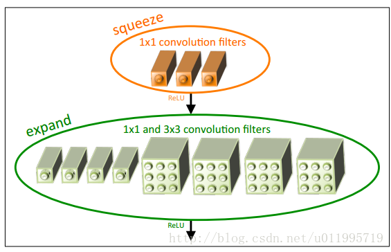
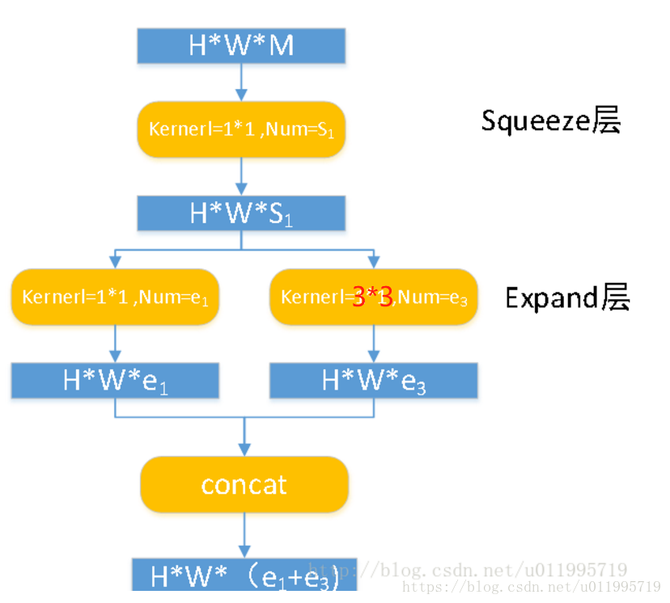
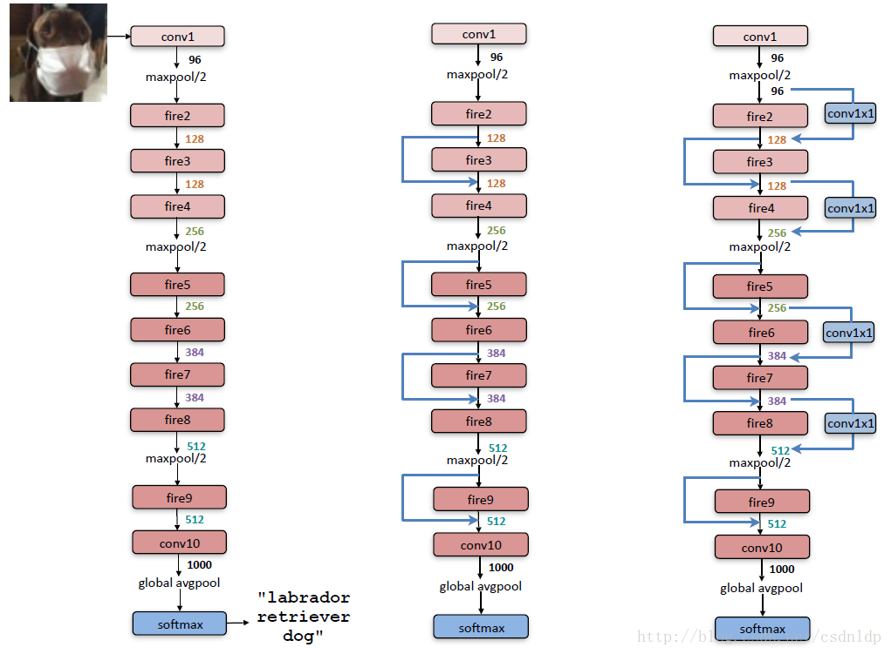
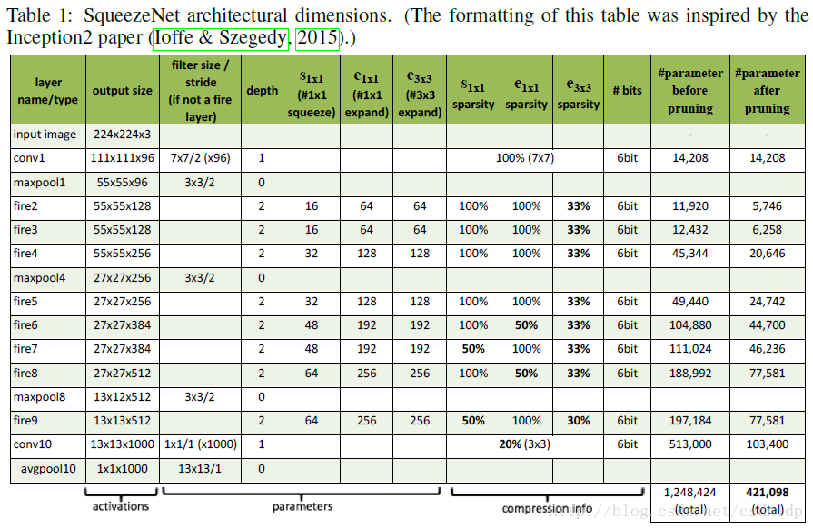
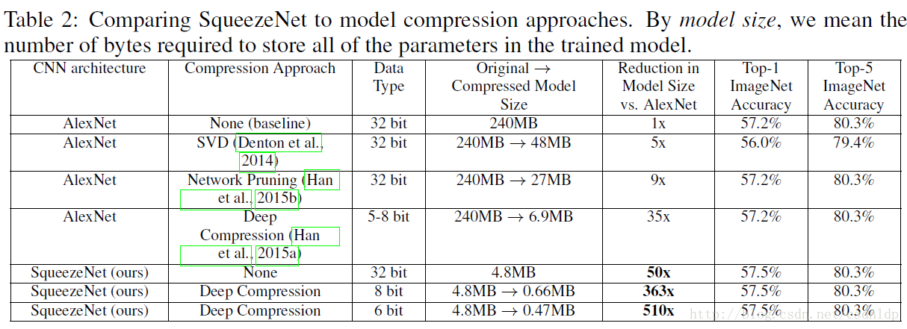

# SqueezeNet

**2016年**

[参考博客原文====](https://blog.csdn.net/P_LarT/article/details/84112793)

[参考博客原文2====](https://blog.csdn.net/csdnldp/article/details/78648543)

## 论文动机

### 概述

最近对深度卷积神经网络（CNNs）的研究**主要集中在提高精度上**。

对于给定的准确度水平，通常存在多个实现该准确度水平的CNN架构。给定等效精度，具有较少参数的CNN架构具有若干优点:

- 更高效的分布式训练。

  服务器间的通信是分布式CNN训练的可扩展性的制约因素。对于分布式的数据并行训练，通信开销与模型中的参数数量成正比（Iandola等，2016）。简言之，小模型需要较少的通信所以训练得更快。

- 传输模型到客户端的耗费较少。

  对于自动驾驶，有些公司，例如特斯拉公司，会定期将新模型从服务器复制到客户的汽车，这种做法通常被称作空中（OTA）升级。 消费者报告指出特斯拉Autopilot的半自动驾驶功能的安全性随着近期的空中升级（消费者报告，2016）而逐渐增强。然而现今典型的CNN/DNN模型的空中升级需要大量的数据传输。例如更新AlexNet模型，需要从服务器传输240MB的通信量到汽车。较小的模型需要的通信更少，这样使得频繁的更新变得更可行。

- 可行的FPGA和嵌入式部署。

  FPGA通常仅有小于10MB的片上存储器而且没有片外存储器。当FPGA实时地处理视频流时，一个足够小的模型能直接存放在FPGA上，而不会让存储带宽成为它的瓶颈（Qiu等，2016）。当在专用集成电路（ASIC）上部署CNN时，一个足够小的模型可以直接存储在芯片上，并使ASIC有可能配得上更小的管芯。 

​	为了提供所有这些优势，我们提出了一个名为SqueezeNet的小型CNN架构。SqueezeNet在ImageNet上实现了AlexNet级别的精度，参数减少了50倍。另外，使用**模型压缩技术**，我们可以将SqueezeNet压缩到小于0.5MB（比AlexNet小510倍）。

### 相关的工作

我们工作的首要目标是**确定一个具有少量参数却同时能保持相当精度的模型**。

为了解决这个问题，一种明智的方法是**以有损的方式去压缩一个现有的CNN模型**。实际上，已经出现了一个关于模型压缩的研究社区，并且也已经提出了一些方法。

#### 模型压缩

Denton等人的一个很直接的方法是把应用奇异值分解（SVD）（Denton等人，2014）应用在预训练好的CNN模型。
Han等人提出了网络修剪，该算法从预训练模型开始，然后把低于某个阈值的参数替换为零，形成了稀疏矩阵，最后对稀疏的CNN模型做几次迭代训练（Han等人，2015b）。
Han等人近期扩展了他们的工作，通过将量化（到8位或更少）和huffman编码结合到网络修剪，创造了一种叫做深度压缩 Deep Compression的方法（Han等人，2015a），并进一步设计了叫做EIE的硬件加速器（Han等人，2016a ），该加速器直接作用在压缩过的模型上，获得了大幅度的加速和节能。 

#### CNN微结构

我们使用术语CNN微结构来指代各个模块的特定的组织和尺寸。

在神经网络，卷积滤波器通常是3D的，它有作为关键维度的高度，宽度和通道。

当应用在图像时，CNN滤波器的第一层通常有3个通道（例如RGB），并且在其后的每一层Li，Li层滤波器的通道数目与Li-1层的滤波器的数量相同。

随着设计非常深的CNN的趋势，手动选择每层的滤波器尺寸变得麻烦。为了解决这个问题，已经出现了各种更高级别的构建块或模块，他们由具有特殊的固定组织的多个卷积层构成。

例如，GoogLeNet论文提出了Inception模块，该模块的滤波器包括多个不同尺寸，通常有1x1和3x3，再加上有时是5x5（Szegedy等人，2014），有时是1x3和3x1（Szegedy等人，2015）。多个这样的模块，可能再加上ad-hoc层，组合起来，形成完整的网络。 

**Fire module**

**演化**

**模型结构**

**模型精度**

