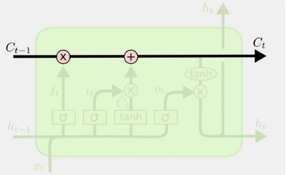

# LSTM 输出

缘由：由于在seq2seq踩的坑 并且一直没能真正弄清楚seq2seq的整个架构，而LSTM便是其中很重要的一个点，在上课讲过attention 和 transform 、BERT之后对seq2seq认识也更佳清晰了，所以相对seq2seq进行更透彻的理解。

直接缘由： 	encoder_outputs, state_h, state_c 

​	对于LSTM的三个输出不理解


[博客原地址 理解Keras LSTM模型中的return_sequences和return_state](https://blog.csdn.net/Ahead_J/article/details/84671396)





在keras LSTM的文档中有两个参数

- **return_sequences**: Boolean. 是否返回最后一个输出或是整个序列的输出，默认是False
- **return_state**: Boolean. 是否在输出之外返回状态，默认是False

输出指的是 **h**，状态指的是 **c**，

默认的情况下lstm返回最后一个timestep的输出 **h**，不返回状态 **c**。


**对于这两个参数的不同组合：**

### 1.return_sequences=False && return_state=False

```python
# 输入：[batch_size, time_step, imput_dim]
outputs = LSTM(6)    # 此时 return_sequences=False && return_state=False
# outputs: [batch_size, 6]
```

此时返回的对输入数据计算得到的 **h**

如果input有多个time_step 则返回最后一个time_step的 **h**


### **2.return_sequences=True && return_state=False** 

```python
# 输入：[batch_size, time_step, imput_dim]
outputs = LSTM(6, return_sequences=True)
# outputs: [batch_size, time_step, 6]
```

此时返回的是全部timestep的 **h**


### 3.return_sequences=False && return_state=True

```python
# 输入：[batch_size, time_step, imput_dim]
outputs, state_h, state_c = LSTM(6, return_state=True)
# outputs: [batch_size, 6]
# state_h: [batch_size, 6]
# state_c: [batch_size, 6]
```

outputs、state_h 返回的是最后一个输出 **h**

state_c 返回的是最后一个time_step的c

### 4.return_sequences=True && return_state=True

```python
# 输入：[batch_size, time_step, imput_dim]
outputs, state_h, state_c = LSTM(6, return_sequences=True, return_state=True)
# outputs: [batch_size, time_step, 6]
# state_h: [batch_size, 6]
# state_c: [batch_size, 6]
```

outputs 是全部的time_step的 **h**

state_h 是最后一个time_step的 **h**

state_c 是最后一个time_step的 **c**

