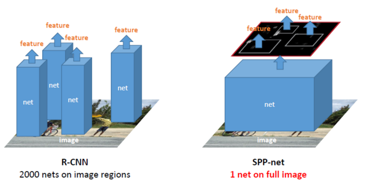
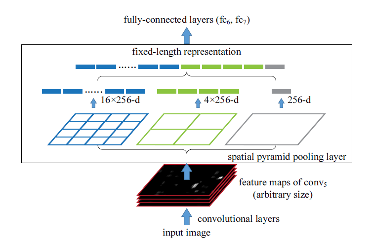

# SPP-Net

## 概述

  R-CNN在当时取得了很大的成果，但是他还是有一些问题，最突出的就是效率问题，SPP-Net主要就是解决R-CNN的几个问题： 1. 对于每张图片的每个proposal跑一边CNN，SVM分类器，做了很多冗余的操作。2.proposal在送进网络之前都要进行拉伸（warp），这样会影响图片的质量以及内容，同时也比较费时费力。
 SPP-Net的改进如下：

1. 送入网络的不再是proposal里的图像，而是一次性的把整个图片送入，而且只输入一次，将通过Selective Search生成的proposal映射到通过卷积网络生成的feature map上，相当于一个proposal中的图像通过一层层卷积得到的feature map
2. CNN网络之所以需要固定输入图像的尺寸，不在于卷积层与池化层，而在于全连接层，全连接层的参数维度需要固定。之前的解决方法都是固定图片的尺寸，这里在最后一层卷积层与FC层之间插入了一层SPP-layer，对于输入任意尺寸都是可以输出相同尺寸的特征。

## 一次性full-image卷积

 相比R-CNN需要对每个proposal做卷积，SPP-Net只做一次卷积，将相应的sub-image映射到full-image卷积后的feature map上从而得到sub-image通过卷积层得到的feature，下图可以很形象的表达：

## Spatital Pyramid Pooling

 这也是本篇paper的亮点之一， 通过一个“池化金字塔”，金字塔的每一层都做一次池化，具体的池化规则相当于为:stride = ⌊a/n⌋⌊a/n⌋window size = ⌈a/n⌉⌈a/n⌉ 其中n为每层最终输出的feature map边长， a为经过最后一层卷积层后的feature map的边长。 这样对于每一层的输出都是固定的，将各层的输出拼接起来作为FC层的输入，具体可以用下图表示：

在单尺度情况下，我们知道了输入图片的大小，那么就可以提前计算出“池化金字塔”每层需要几乘几的格子（bin）来池化，同时SPP也起到了多尺度训练的作用。

## 多尺度训练与测试

  理论上SPP-Net可以用于任何尺寸的图片输入，但在训练时候不能随意输入任意大小的图片，因为“池化金字塔”的n x n “bins“需要提前设定，不同的尺寸的图片用同一Spatital Pyramid Pooling可能会输出不同规格的feature map。   

​	训练过程中，其实使用的是共享参数的多个固定尺寸的网络实现了不同输入尺寸的SPP-Net。其中从一个尺寸编导另一个尺寸使用的缩放而不是裁剪，这样不同尺度的区域仅仅是分辨率上的不同，内容与布局没有变化。   为了降低从一个网络（比如224）向另一个网络（比如180）切换的开销，在每个网络上训练一个完整的epoch，然后在下一个完成的epoch再切换到另一个网络（权重保留）。依此往复。实验中发现多尺寸训练的收敛速度和单尺寸差不多。多尺寸训练的主要目的是在保证已经充分利用现在被较好优化的固定尺寸网络实现的同时，模拟不同的输入尺寸.   

​	注意，上面的多尺寸解析度只用于训练。在测试阶段，是直接对各种尺寸的图像应用SPP-net的。

## 如何将原图的proposal映射到到feature map上

 为了简单起见，对每一层卷积层进行padding，大小为⌊p/2⌋⌊p/2⌋，其中pp为卷积核的边长，这样卷积过程中feature map规格不会变，这样原图上的某点(x,y)(x,y) 与在 feature map上相应点(x′,y′)(x′,y′)的关系为： 左(上)边界x′=⌊x/S⌋+1,x′=⌊x/S⌋+1, 右(下)边界 x′=⌈x/S⌉−1x′=⌈x/S⌉−1, 同时，如果padding不是⌊p/2⌋⌊p/2⌋，需要对x进行一些补偿。

PS： paper中直接给出结论， 具体证明还没有去做，之后补上

##  SPP-Net的一些不足

1. 虽然解决了R-CNN许多大量冗余计算的问题，但是还是沿用了R-CNN的训练结构，也训练了SVM分类器， 单独进行BBox regression。
2. SPP-Net 很难通过fine-tuning对SPP-layer之前的网络进行参数微调，效率会很低，原因具体是（Fast-RCNN中的解释）： SPP做fine-tuning时输入是多个不同的图片，这样对于每一个图片都要重新产出新的feature map，效率很低，而Fast-RCNN对其进行了改进。

