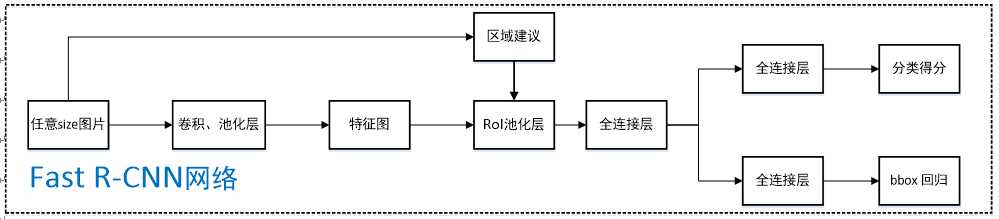
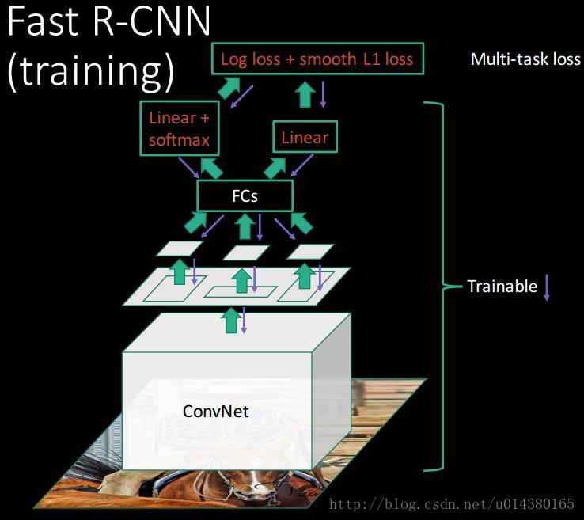
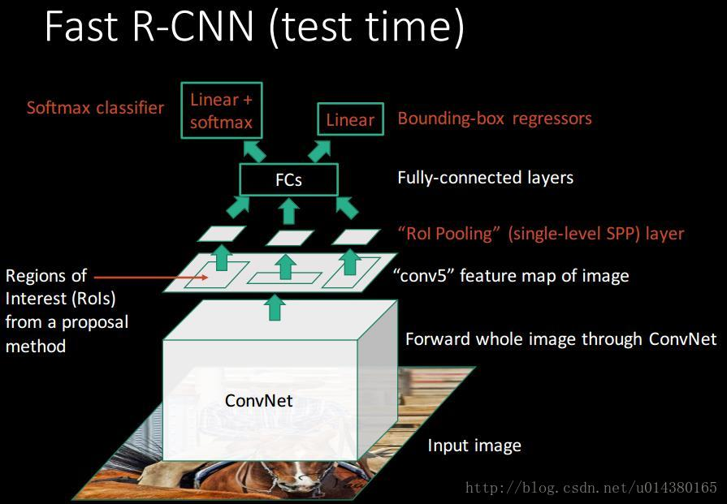

# Fast R-CNN

## 概述

  Fast R-CNN最主要的是解决了SPP-Net与R-CNN训练步骤复杂、冗余的缺点，首先它同样对整个图像只做一次卷积提取full-image feature map，其次它利用了ROI pooling layer（可以看做SPP的简化版） 进行固定送入FC层的feature尺寸，从而达到对任意尺寸的图像进行训练及测试，最后它将分类与回归同时进行，相当于多任务学习，他们共享前面网络的特征与计算，这样也不需要利用磁盘对特征进行存储。同时Fast R-CNN也对损失函数，FC层加速等做了优化。同时该文章还通过实验证明了深度网络具有较好的scale-invariance，即对scale并不是特别敏感。

## 网络结构

Fast R-CNN 将整个图片与通过Selective Search筛选出的region proposals一同输入，经过卷积层、池化层产出feature map，计算出原图的proposal在feature map的映射，将相应的feature送到ROI pooling层，进行池化，产出固定长度的feature vector作为FC层（SVD分解实现）的输入最终分支成两个兄弟输出层：一个通过softmax产生K+1个分类的概率，另一个对于每个object 类别输出四个实数，代表一个较为精确的BBox position,最后进行NMS得到最终的结果。具体网络结构如下图： 

## ROI pooling

  具体做法首先将原始图片的proposal映射到feature map上，取出相应的feature，假设feature长H宽W，要输出的规格为h x w，那么就把原feature分成 h x w，对每一块区域做max pooling，得到一个固定h x w规格的feature vector送入FC层。

## SVD分解实现FC层加速

  图像分类任务中，用于卷积层计算的时间比用于全连接层计算的时间多，而在目标检测任务中，selective search算法提取的建议框比较多，几乎有一半的前向计算时间被花费于全连接层，就Fast R-CNN而言，RoI池化层后的全连接层需要进行约2k次（每个建议框都要计算），因此在Fast R-CNN中可以采用SVD分解加速全连接层计算；
SVD原理：
【待补充】

  在实现时，相当于把一个全连接层拆分为两个全连接层，第一个全连接层不含偏置，第二个全连接层含偏置；实验表明，SVD分解全连接层能使mAP只下降0.3%的情况下提升30%的速度，同时该方法也不必再执行额外的微调操作。

PS:因为最近事情真的比较多，所以SVD的学习以后再进行。

## 使用softmax进行预测概率而不是SVM

  针对Fast R-CNN，文中分别进行实验并对比了采用SVM和采用softmax的mAP结果，不管AlexNet【S for small】、VGG_CNN_M_1024【M for medium】、VGG-16【L for large】中任意网络，采用softmax的mAP都比采用SVM的mAP高0.1%~0.8%，这是由于softmax在分类过程中引入了类间竞争，分类效果更好；（对于类间竞争，我的理解是softmax所有类的概率相加为1，一个类的概率变高，其他类的概率必然有所下降，这样即使论文中的competition between classes）
Fast R-CNN去掉了SVM这一步，所有的特征都暂存在显存中，就不需要额外的磁盘空间，省时省力。

 【疑问】 关于为什么Fast R-CNN可以舍弃SVM分类器而直接采用softmax，而不会出现因为IOU阈值选的0.5导致softmax的精度下降，我目前没有十分确切的想法，认为可能有以下几点原因（猜想）：

1. R-CNN是对原图片进行wrap，所以可能会导致图片的某些信息在卷积层跟池化层丢失（因为拉伸或者压缩，一些像素出现在不应该出现的位置），而Fast R-CNN则将原图完好的进行了卷积与池化，再通过ROI池化。
2. Fast R-CNN 通过较深的网络训练，相比R-CNN有更强的性能，因此搜反而，softmax更好一点。
3. ROI pooling 比 max pooling 更好一点（雾

## 单尺度训练与测试

  brute-force（单一尺度）和image pyramids（多尺度）。单一尺度直接在训练和测试阶段将image定死为某种scale，直接输入网络训练就好，然后期望网络自己能够学习到scale-invariance的表达；多尺度在训练阶段随机从图像金字塔（缩放图片的scale得到，相当于扩充数据集）中采样训练，测试阶段将图像缩放为金字塔中最为相似的尺寸进行测试；

  可以看出，多尺度应该比单一尺度效果好。作者在5.2节对单一尺度和多尺度分别进行了实验，不管哪种方式下都定义图像短边像素为s，单一尺度下s=600（维持长宽比进行缩放），长边限制为1000像素；多尺度s={480,576,688,864,1200}（维持长宽比进行缩放），长边限制为2000像素，生成图像金字塔进行训练测试；实验结果表明AlexNet（S for small）、VGG_CNN_M_1024（M for medium）下单一尺度比多尺度mAP差1.2%~1.5%，但测试时间上却快不少，VGG-16（L for large）下仅单一尺度就达到了66.9%的mAP（由于GPU显存限制多尺度无法实现），该实验证明了深度神经网络善于直接学习尺度不变形，对目标的scale不敏感。

以上基本上论文翻译，文中解释的很好。

## R-CNN(SPP-Net)与Fast-RCNN不同的样本采样

  R-CNN和SPPnet中采用RoI-centric sampling：从所有图片的所有候选区域中均匀取样，这样每个SGD的mini-batch中包含了不同图像的样本，不同图像之间不能共享卷积计算和内存，运算开销大；
Fast R-CNN中采用image-centric sampling： mini-batch采用层次采样，即先对图像采样(N个)，再在采样到的图像中对候选区域采样(每个图像中采样R/N个，一个mini-batch共计R个候选区域样本)，同一图像的候选区域卷积共享计算和内存，降低了运算开销；
  image-centric sampling方式采样的候选区域来自于同一图像，相互之间存在相关性，可能会减慢训练收敛的速度，但是作者在实际实验中并没有出现这样的担忧，反而使用N=2，R=128的RoI-centric sampling方式比R-CNN收敛更快。

  这里解释一下为什么SPPnet不能更新spatial pyramid pooling层前面的卷积层，而只能更新后面的全连接层？
  有网友解释说卷积特征是线下计算的，从而无法在微调阶段反向传播误差；另一种解释是(论文解释)，反向传播需要计算每一个RoI感受野的卷积层梯度，通常所有RoI会覆盖整个图像，如果用RoI-centric sampling方式会由于计算too much整幅图像梯度而变得又慢又耗内存。

 ## 需要fine-tuning的参数

  SPPnet论文中采用ZFnet（AlexNet的改进版）这样的小网络，其在微调阶段仅对全连接层进行微调，就足以保证较高的精度，作者文中采用VGG-16（L for large）网络，若仅仅只对全连接层进行微调，mAP会从66.9%降低到61.4%， 所以文中也需要对RoI池化层之前的卷积层进行微调；

那么问题来了？向前微调多少层呢？所有的卷积层都需要微调吗？
  作者经过实验发现仅需要对conv3_1及以后卷积层（即9-13号卷积层）进行微调，才使得mAP、训练速度、训练时GPU占用显存三个量得以权衡；
  作者说明所有AlexNet（S for small）、VGG_CNN_M_1024（M for medium）的实验结果都是从conv2往后微调，所有VGG-16（L for large）的实验结果都是从conv3_1往后微调。

## Fast R-CNN 训练与测试的流程图

