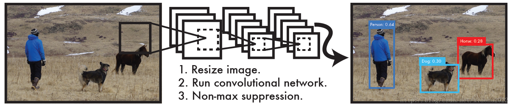
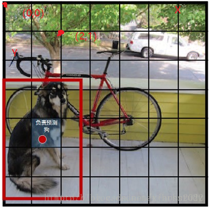
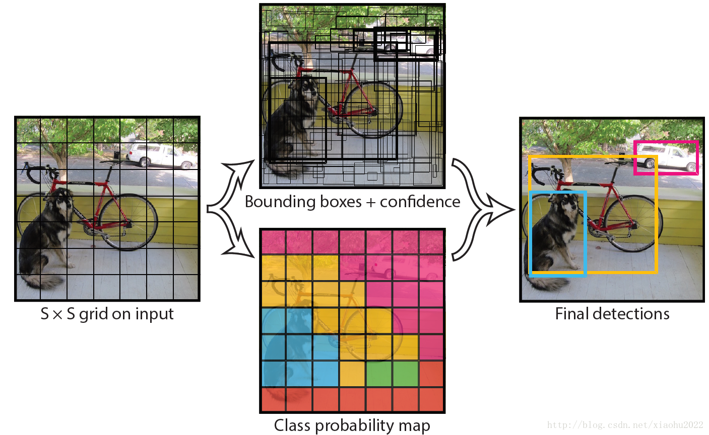
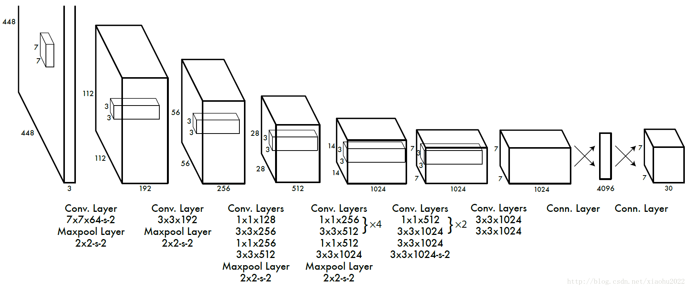
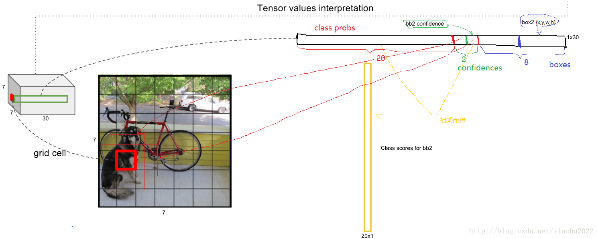
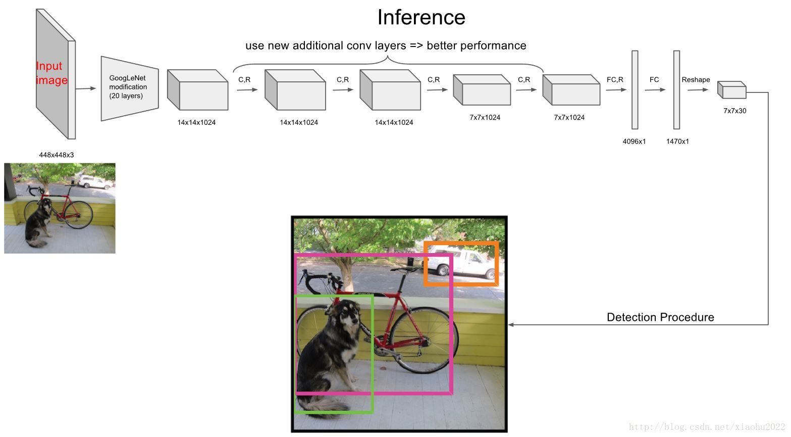
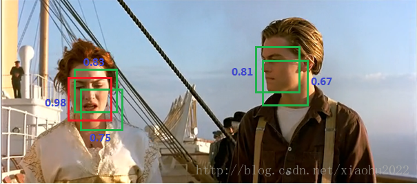
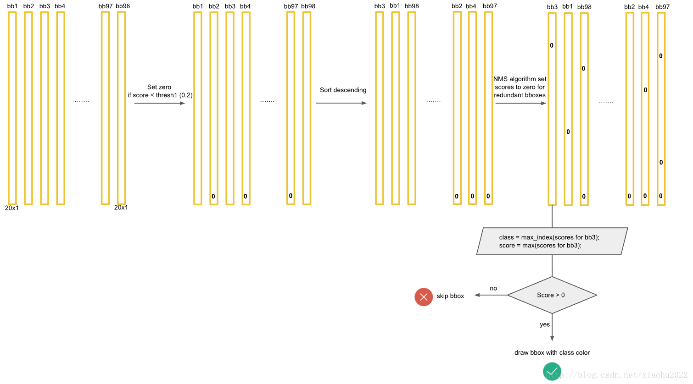
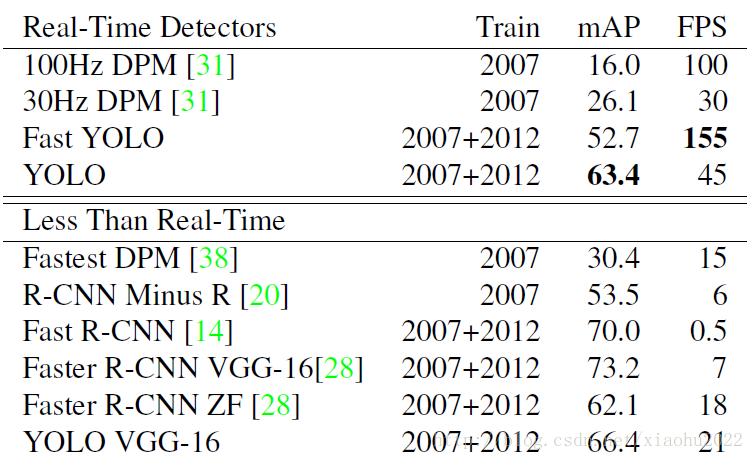

# YOLO

[博客地址========](https://blog.csdn.net/m0_37192554/article/details/81092514)

## 设计理念

整体来看，Yolo算法采用一个单独的CNN模型实现end-to-end的目标检测，整个系统如图5所示：首先将输入图片resize到448x448，然后送入CNN网络，最后处理网络预测结果得到检测的目标。相比R-CNN算法，其是一个统一的框架，其速度更快，而且Yolo的训练过程也是end-to-end的。

图5 Yolo检测系统

具体来说，Yolo的CNN网络将输入的图片分割成，其中前4个表征边界框的大小与位置，而最后一个值是置信度。

还有分类问题，对于每一个单元格其还要给出预测出。边界框类别置信度表征的是该边界框中目标属于各个类别的可能性大小以及边界框匹配目标的好坏。后面会说，一般会根据类别置信度来过滤网络的预测框。

总结一下，每个单元格需要预测大小的张量。在下面的网络结构中我们会详细讲述每个单元格的预测值的分布位置。

图7 模型预测值结构

## 网络设计

Yolo采用卷积网络来提取特征，然后使用全连接层来得到预测值。网络结构参考GooLeNet模型，包含24个卷积层和2个全连接层，如图8所示。对于卷积层，主要使用1x1卷积来做channle reduction，然后紧跟3x3卷积。对于卷积层和全连接层，采用Leaky ReLU激活函数：。但是最后一层却采用线性激活函数。除了上面这个结构，文章还提出了一个轻量级版本Fast Yolo，其仅使用9个卷积层，并且卷积层中使用更少的卷积核。

可以看到网络的最后输出为是边界框的预测结果。这样，提取每个部分是非常方便的，这会方面后面的训练及预测时的计算。

图9 预测张量的解析

## 网络训练

在训练之前，先在ImageNet上进行了预训练，其预训练的分类模型采用图8中前20个卷积层，然后添加一个average-pool层和全连接层。预训练之后，在预训练得到的20层卷积层之上加上随机初始化的4个卷积层和2个全连接层。由于检测任务一般需要更高清的图片，所以将网络的输入从224x224增加到了448x448。整个网络的流程如下图所示：

 

## 网络预测

在说明Yolo算法的预测过程之前，这里先介绍一下非极大值抑制算法（non maximum suppression, NMS），这个算法不单单是针对Yolo算法的，而是所有的检测算法中都会用到。NMS算法主要解决的是一个目标被多次检测的问题，如图11中人脸检测，可以看到人脸被多次检测，但是其实我们希望最后仅仅输出其中一个最好的预测框，比如对于美女，只想要红色那个检测结果。那么可以采用NMS算法来实现这样的效果：首先从所有的检测框中找到置信度最大的那个框，然后挨个计算其与剩余框的IOU，如果其值大于一定阈值（重合度过高），那么就将该框剔除；然后对剩余的检测框重复上述过程，直到处理完所有的检测框。Yolo预测过程也需要用到NMS算法。

图11 NMS应用在人脸检测

下面就来分析Yolo的预测过程，这里我们不考虑batch，认为只是预测一张输入图片。根据前面的分析，最终的网络输出是个边界框。

所有的准备数据已经得到了，那么我们先说第一种策略来得到检测框的结果，我认为这是最正常与自然的处理。首先，对于每个预测框根据类别置信度选取置信度最大的那个类别作为其预测标签，经过这层处理我们得到各个预测框的预测类别及对应的置信度值，其大小都是。一般情况下，会设置置信度阈值，就是将置信度小于该阈值的box过滤掉，所以经过这层处理，剩余的是置信度比较高的预测框。最后再对这些预测框使用NMS算法，最后留下来的就是检测结果。一个值得注意的点是NMS是对所有预测框一视同仁，还是区分每个类别，分别使用NMS。Ng在deeplearning.ai中讲应该区分每个类别分别使用NMS，但是看了很多实现，其实还是同等对待所有的框，我觉得可能是不同类别的目标出现在相同位置这种概率很低吧。

上面的预测方法应该非常简单明了，但是对于Yolo算法，其却采用了另外一个不同的处理思路（至少从C源码看是这样的），其区别就是先使用NMS，然后再确定各个box的类别。其基本过程如图12所示。对于98个boxes，首先将小于置信度阈值的值归0，然后分类别地对置信度值采用NMS，这里NMS处理结果不是剔除，而是将其置信度值归为0。最后才是确定各个box的类别，当其置信度值不为0时才做出检测结果输出。这个策略不是很直接，但是貌似Yolo源码就是这样做的。Yolo论文里面说NMS算法对Yolo的性能是影响很大的，所以可能这种策略对Yolo更好。但是我测试了普通的图片检测，两种策略结果是一样的。

图12 Yolo的预测处理流程

## 算法性能分析

这里看一下Yolo算法在PASCAL VOC 2007数据集上的性能，这里Yolo与其它检测算法做了对比，包括DPM，R-CNN，Fast R-CNN以及Faster R-CNN。其对比结果如表1所示。与实时性检测方法DPM对比，可以看到Yolo算法可以在较高的mAP上达到较快的检测速度，其中Fast Yolo算法比快速DPM还快，而且mAP是远高于DPM。但是相比Faster R-CNN，Yolo的mAP稍低，但是速度更快。所以。Yolo算法算是在速度与准确度上做了折中。

表1 Yolo在PASCAL VOC 2007上与其他算法的对比 

