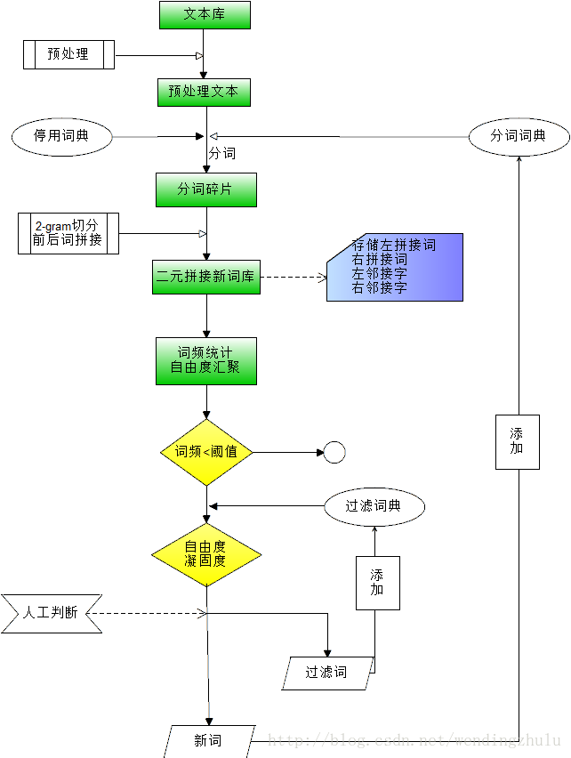

## 中文新词算法

现在社交网络和视频网站发展都非常迅猛，参与人数非常多，每日UGC量非常可观。也因此经常制造爆炸性新闻，新词的制造和流行也频频出现。不同的社交圈内，由于话题性的不同，其新词分布也不同，所以直接引入搜狗等输入法的新词，会造成新词污染。因此，往往需要基于自营社交圈的语料库做新词发现，才能实现更精确的文本语义分析。

 

##  算法解析：

我将新词发现流程比喻为判断默认男女是否为伴侣关系（这里限指关系比较稳定的）。假设你有一次看到A(男)和B(女)两人在街上一起肩并肩地行走，你会觉得两个人应该互相认识（凝固度还比较低）；如果两个人牵着手，有说有笑，你可认为两个人肯定认识但还不一定是伴侣，也可能是兄妹吧（凝固度有提高，但是还不够高）；如果在你犹豫的时候，两个人相拥而吻，你肯定下定决心，这两个人是伴侣（凝固度很高哦）。但是，你可能错了，因为这两个人可能只是一夜情，并算不上伴侣吧（因为你就只看了一次，自由度太低）。如果，在接下来的一个月内，你经常在不同的地方和时间（情景很多，说明双方比较自由，没有其他伴侣的束缚）看到过两个人亲密接触，这个时候，你基本上有百分九十以上的把握认定二人是伴侣关系。

是的，新词发现的整个判定方式和上面是一致的。你需要从凝固度和自由度两个角度考虑你通过一元分词的相邻词组合而成的“新词”是否是语境中真正的一个词。

下面具体阐述新词探索：

新词组合方式：

先中文分词工具做一元分词，使用Lucene TokenStream的OffsetAttribute类，将前后位置相邻的词拼接成新词，注意，在做一元分词的时候不宜将停词去除，前后位置相邻不包含分隔符号。整个语料库比较大，可以采用Hadoop的MapReduce处理，也可以单机慢慢跑。比如原始的分词字典对“三国杀是款桌上游戏”分词，得到的结果是“三国_杀_是_款_桌上_游戏”。组合的二元词有“三国杀”、“杀是”、“是款”、“款桌上”、“桌上游戏”。统计二元词的左右自由度和凝固度，划定阈值，即可判定二元词是否是新词

具体主题代码如下：

public static void segNewWord(Analyzer analyzer, String fieldName, String string, Context context, Long topic_id) {
           try {
                 TokenStream tokenStream = analyzer.tokenStream(fieldName, new StringReader(string));
                 CharTermAttribute charTermAttribute = tokenStream.addAttribute(CharTermAttribute.class);
                 // 偏移量
                 OffsetAttribute offsetAttribute = tokenStream.addAttribute(OffsetAttribute.class);
                 tokenStream.reset();
                 …… …… //词拼接
                          //辅助信息，用于在reduce中合并统计
                            String newWordInfo = aforeWord + "\t" + token + "\t" + aforeChar.toString()
                                       + "\t" + afterChar.toString() + "\t" + topic_id.toString();
                            try {
                                  context.write(new Text(newWord), new Text(newWordInfo));
                            } catch (InterruptedException e) {
                                  e.printStackTrace();
                            }
                      }
                     
                      aforeWord = token;
                      aforeOffset = offsetAttribute.startOffset() - 1;
                      offset = offsetAttribute.endOffset();
                 }
                
                 tokenStream.close();
           } catch (IOException e) {
                 e.printStackTrace();
           }
      }
其中，分词Analyzer使用的是Jcseg开源分词工具。

 新词过滤条件总结：

1.      凝固度

凝固度是指一个新词单独出现的频次很高，远高于其组合词的概率之和。

假设是二元组词，词A和词B单独出现的概率分别是P(A)和P(B)，假设这两个词是独立词，则两个词同时出现的概率为P(A)*P(B)。如果这两个词不是独立的，则两个词同时出现的条件概率会大于P(A)*P(B)，即P(C) >>P(A)*P(B)。一般远大于，量级设定为1000倍。

 

2.      自由度

文本片段的自由运用程度也是判断它是否成词的重要标准。如果一个文本片段能够算作一个词的话，它应该能够灵活地出现在各种不同的环境中，具有非常丰富的左邻字集合和右邻字集合。

左（或右）邻接字频 / 词频 > 0.2。说明左（或右）邻接有其他词和该词经常同时出现，往往邻接词比该词更有代表性。比如“欧丽格”

 

3.      新词IDF

IDF表征了新词在文档中出现的次数，如果出现的频次越高，说明这个词在不同的环境中出现的概率更高（这个和自由度有相似性）。IDF在论坛中提取新词具有特定的意义，表征了新词在不同帖子中的认同度。一般IDF越高，说明其倍认可度越高，越有可能是新词。[但是如果IDF非常高，反而代表这个词非常普通，不一定必要进入到新词库，尤其是为了防止造成新词污染，影响词的原子性。]

  

效果演示：

新词过滤条件总结：

1.      凝固度

凝固度是指一个新词单
--------------------- 
版权声明：本文为CSDN博主「WaveVector」的原创文章，遵循CC 4.0 by-sa版权协议，转载请附上原文出处链接及本声明。
原文链接：https://blog.csdn.net/wendingzhulu/article/details/44464895

 

1.      凝固度
---------------------
版权声明：本文为CSDN博主「WaveVector」的原创文章，遵循CC 4.0 by-sa版权协议，转载请附上原文出处链接及本声明。
原文链接：https://blog.csdn.net/wendingzhulu/article/details/44464895

 

新词
--------------------- 
版权声明：本文为CSDN博主「WaveVector」的原创文章，遵循CC 4.0 by-sa版权协议，转载请附上原文出处链接及本声明。
原文链接：https://blog.csdn.net/wendingzhulu/article/details/44464895