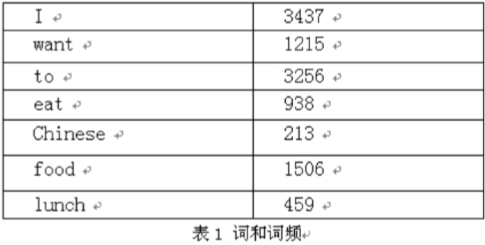
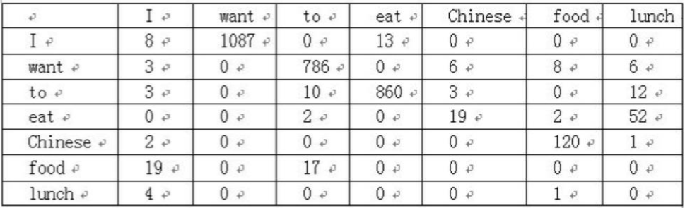
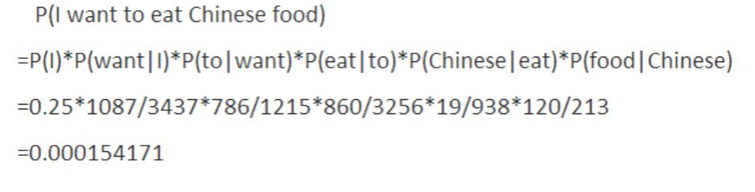
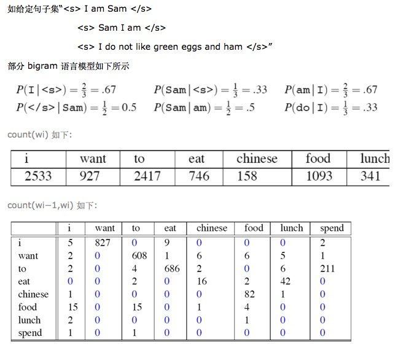
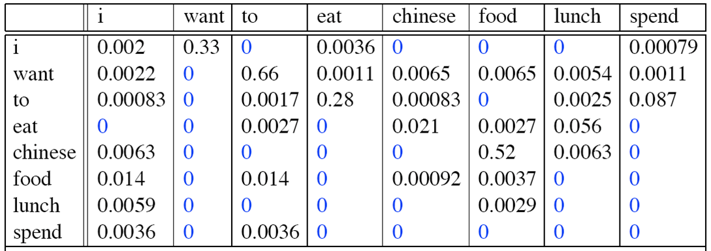
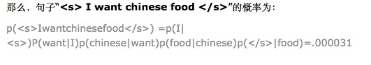

# N-gram


## 1.N-Gram的介绍

N-Gram是基于一个假设：第n个词出现与前n-1个词相关，而与其他任何词不相关（这也是隐马尔可夫当中的假设）。整个句子出现的概率就等于各个词出现的概率乘积。各个词的概率可以通过语料中统计计算得到。通常N-Gram取自文本或语料库。

N=1时称为unigram，N=2称为bigram，N=3称为trigram，假设下一个词的出现依赖它前面的一个词，即 bigram，假设下一个词的出现依赖它前面的两个词，即 trigram，以此类推。

举例中文：“你今天休假了吗”，它的bigram依次为：

你今，今天，天休，休假，假了，了吗

理论上，n 越大越好，经验上，trigram 用的最多，尽管如此，原则上，**能用 bigram 解决，绝不使用 trigram。**

假设句子T是有词序列w1,w2,w3...wn组成，用公式表示N-Gram语言模型如下：

```
`P(T)``=``P(w1)``*``p(w2)``*``p(w3)``*``*``*``p(wn)``=``p(w1)``*``p(w2|w1)``*``p(w3|w1w2)``*``*` `*``p(wn|w1w2w3...) p(T) 就是语言模型，即用来计算一个句子 T 概率的模型。`
```

以上公式难以实际应用。此时出现马尔可夫模型，该模型认为，一个词的出现仅仅依赖于它前面出现的几个词。这就大大简化了上述公式。

```
`P(w1)P(w2|w1)P(w3|w1w2)…P(wn|w1w2…wn``-``1``)≈P(w1)P(w2|w1)P(w3|w2)…P(wn|wn``-``1``)`
```

一般常用的N-Gram模型是Bi-Gram和Tri-Gram。分别用公式表示如下： 

```
`Bi``-``Gram:  P(T)``=``p(w1|begin)``*``p(w2|w1)``*``p(w3|w2)``*``*``*``p(wn|wn``-``1``) <br>``Tri``-``Gram:  P(T)``=``p(w1|begin1,begin2)``*``p(w2|w1,begin1)``*``p(w3|w2w1)``*``*``*``p(wn| wn``-``1``,wn``-``2``)`
```

注意上面概率的计算方法：P(w1|begin)=以w1为开头的所有句子/句 子总数；p(w2|w1)=w1,w2同时出现的次数/w1出现的次数。以此类推


## 2.一个经典的二元语言模型例子



语料库中一些单词的词频，统计出各个单词与其他单词的前后联系的频次，组成一个7*7的二维矩阵，如下图



那么语句  “I want to eat Chinese food”  的二元语言模型概率计算过程如下



## 3.构建N-Gram语言模型

通常，通过计算最大似然估计（Maximum Likelihood Estimate）构造语言模型，这是对训练数据的最佳估计，如 bigram 公式如下：

p(wi|wi−1)=fraccount(wi−1,wi)count(wi−1)——条件概率



则 bigram 为：






​                       <s> Sam I am </s>

​                       <s> I do not like green eggs and ham </s>”

部分 bigram 语言模型如下所示


