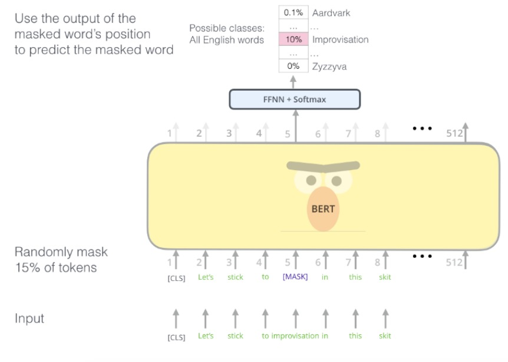
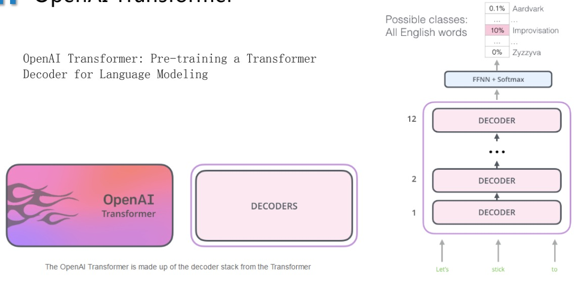
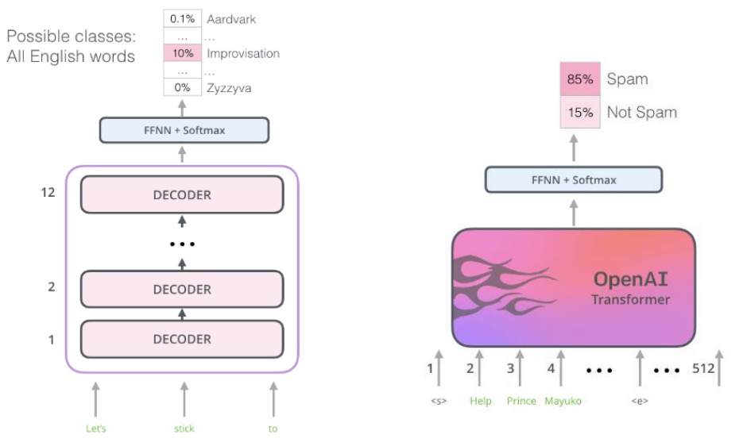
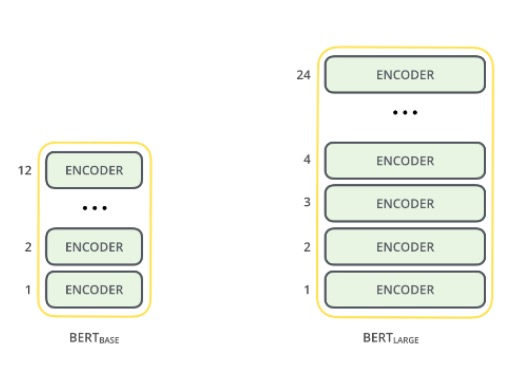
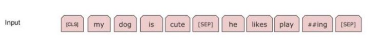
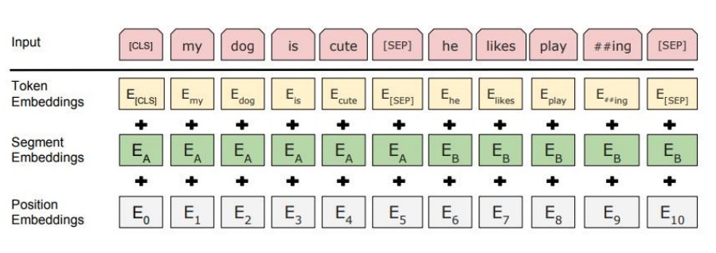

# BERT

**BERT的全称：Bidirectional Encoder Representations from Transformers**

## BERT的知识点汇总

- Semi-supervised Sequence Learning
- Masked Language Model
- Bidirectional encoder: openAI transforom:pre-trained decoder
- sentence-level

## 迁移策略，下游具有具体NLP任务主要分为4大类

- 系列标注：分词、实体识别、语义识别
- 分类任务：文本分类，情感计算
- 句子关系判断：entailment、QA、自然语言推理
- 生成式任务：机器翻译、文本摘要

## Semi-supervised Sequence Learning

其实本文的核心倒不是模型架构本身，而是一种预训练的思路。该思路就是，利用无标签数据先训练模型（非监督学习），由此得到的参数，作为下一阶段模型训练的初始化参数（监督学习）。因此，本文取名半监督学习（semi-supervised）。

## Masked Language Model

## OpenAI Transformer

OpenAI Transformer: Pre-training a Transformer 
Decoder for Language Modeling

## Bidirectional encoder

- BERT BASE – Comparable in size to the OpenAI Transformer in order to 
  compare performance
- BERT LARGE – A ridiculously huge model which achieved the state of the 
  art results reported in the paper

## Sentence-level

句子负采样
句子级别的连续性预测任务，即预测输入BERT的两端文本是否为连续的文本。
训练的时候，
- 负样本：输入模型的第二个片段会以50%的概率从全部文本中随机选取，
- 正样本：剩下50%的概率选取第一个片段的后续的文本。
句子级表示

Segement embedding
对于句对来说，EA和EB分别代表左句子和右句子；
对于句子来说，只有EA。这个EA和EB也是随模型训练出来的。
如下图所示，最终输入结果会变成下面3个embedding拼接的表示

