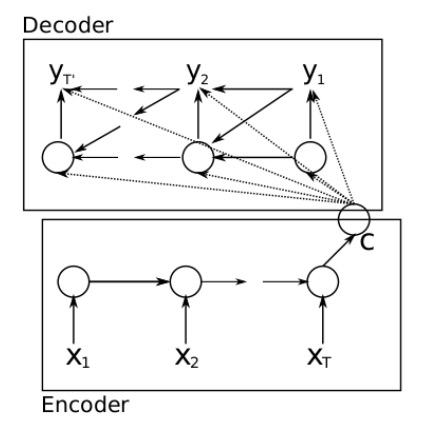
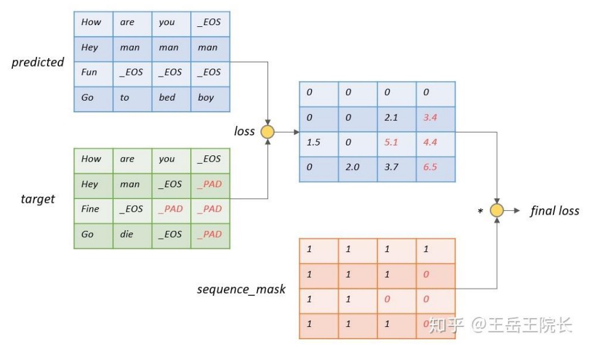

# Seq2seq的代码训练

## 注意力机制

注意：
（1）C在decoder中每次都要用到。
（2）encoder传入两变量：xt和h(t-1) decoder传入三变量：yt、s(t-1)、c。
（3）encoder里面可以直接使用basic_lstm、dynamic rnn Decoder里面使用的是basic_decoder、dynamic_decoder

## Sequence loss

