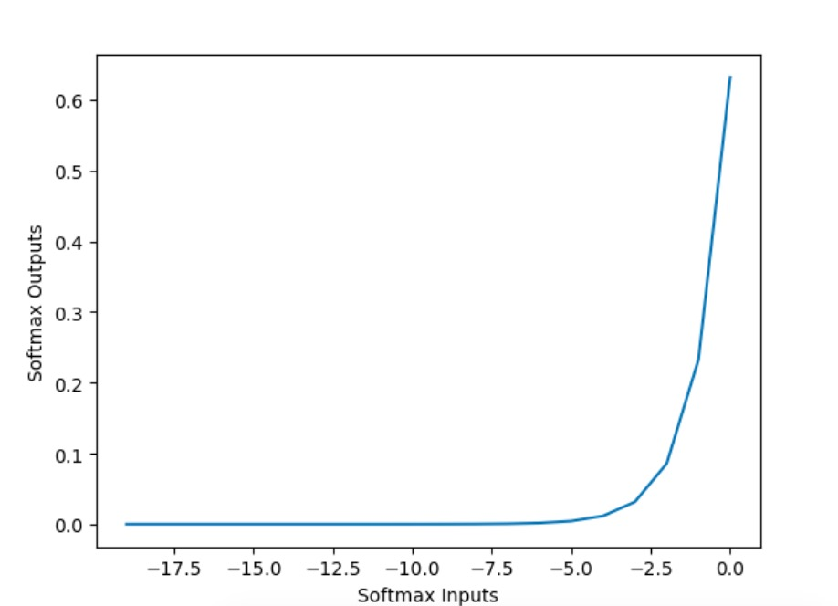
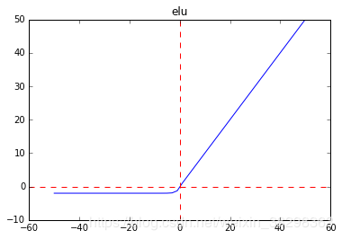
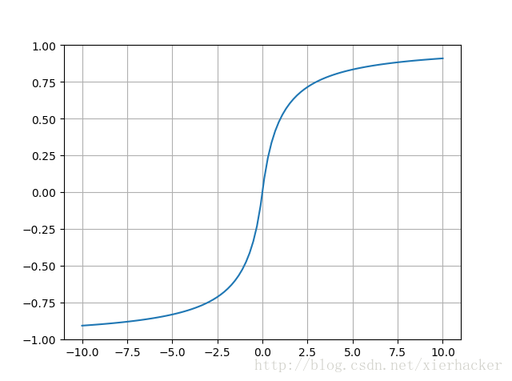
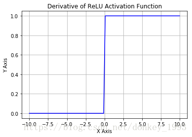
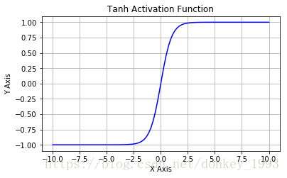
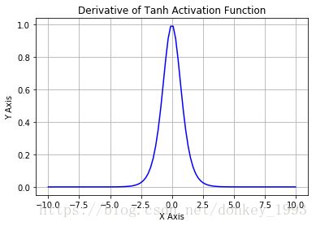
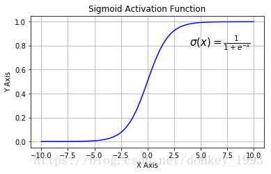
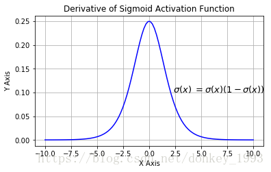

**激活函数**

​	激活函数是神经网络非线性变换的来源，因为如果去掉这些函数，那么整个网络就只剩下线性运算，线性运算的复合还是线性运算，最终的效果只相当于单层的线性模型。

[函数饱和性说明](./301函数饱和性.md)

- [1 softmax](#1)

- [2 elu](#2)
- [3 selu](#3)
- [4 softsign](#4)
- [5 relu](#5)
- [6 tanh](#6)
- [7 sigmoid](#7)
- [8 hard_sigmoid](#8)
- [9 exponential](#9)
- [10 linear](#10)

# <a name=""> 1 softmax </a>

​	多分类问题，输出层一般使用softmax函数作为激活函数

- 公式

$$
softmax = \frac{e^{z_j}}{\sum_{k=1}^{K}e^{z_k}} forj=1,...,k
$$

- 图形

  

# <a name=""> 2 elu </a>

$$
f(x)’=\left\{
\begin{aligned}
x & = & x>0 \\
a(e^{x}-1) & = & x\leq0 \\ 
\end{aligned}
\right.
$$

- 融合了sigmoid和ReLU，左侧具有软饱和性，右侧无饱和性。
- 右侧线性部分使得ELU能够缓解梯度消失，而左侧软饱能够让ELU对输入变化或噪声更鲁棒。
  ELU的输出均值接近于零，所以收敛速度更快。
- 在 ImageNet上，不加 Batch Normalization 30 层以上的 ReLU 网络会无法收敛，PReLU网络在MSRA的Fan-in （caffe ）初始化下会发散，而 ELU 网络在Fan-in/Fan-out下都能收敛。

 

# <a name=""> 3 selu </a>

$$
selu(x)=λ\left\{
\begin{aligned}
x & = & x>0 \\
αe^x-α & = & x\leq0 \\ 
\end{aligned}
\right.
$$

# <a name="">4 softsign </a>

- 函数

$$
f(x)=\frac{x}{|x|+1}
$$

# <a name=""> 5 relu </a>

- 函数

$$
relu=max(x, 0)
$$

- 导数

$$
f(x)’=\left\{
\begin{aligned}
0 & = & x\leq0 \\
1 & = & x>0 \\ 
\end{aligned}
\right.
$$

# <a name=""> 6 tanh </a>

- 公式

$$
tanh(x)=\frac{sinh(x)}{cosh(x)}=\frac{e^x-e^{-x}}{e^x+e^{-x}}
$$

- 图形

- 导数图形

  [tanh导数的推导过程](./201tanh求导.md)

$$
tanh(x)’=1-tanh(x)^2
$$

- 优点
  - 收敛速度比Sigmoid函数快		
  - 其输出以0为中心点

- 缺点
  - 存在软饱和的问题，容易造成梯度消失

# <a name=""> 7 sigmoid </a>

​	神经网络发明之初一般使用的都是sigmoid函数作为激活函数

​	二分类问题输出层一般使用sigmoid

$$
sigmoid=\frac{1}{1+e^{-x}}
$$

- 图形

- 导数图形

[求导过程](./202sigmoid导数.md)
$$
sigmoid\dot{}=sigmoid(1-sigmoid)
$$

- sigmoid优点
  - 求导容易
  - Sigmoid函数的输出映射在(0, 1)之间，单调连续输出范围有限，优化稳定客源作用输出层

- 缺点
  - 由于其软饱和性，容易造成梯度消失问题
  - 其输出没有以0为中心

# <a name=""> 8 hard_sigmoid </a>

$$
f(x)=clip(\frac{x+1}{2},0,1)=max(0, min(1,\frac{x+1}{2}))
$$

# <a name=""> 9 exponential </a>

# <a name=""> 10 linear </a>

