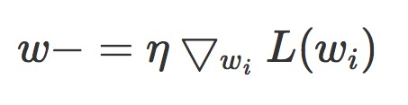
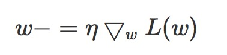
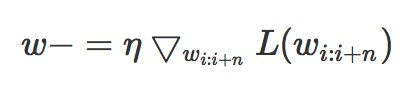
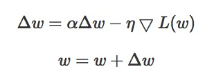
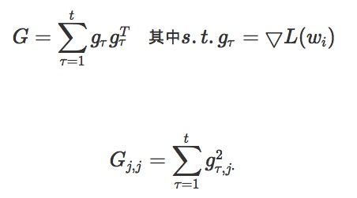
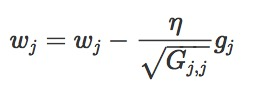
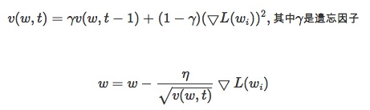
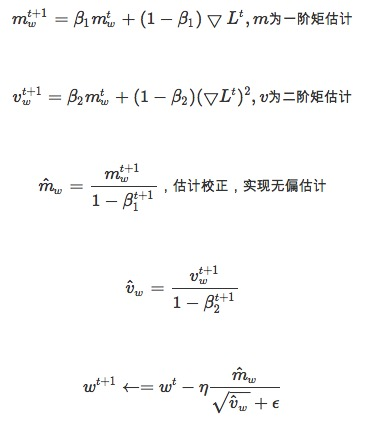

# 深度学习优化方法 Optimizer

​	深度学习所有算法都要利用损失函数lossfuncation来检验算法模型的优劣，同时利用损失函数来提升算法模型。 

- [1 SGD&BGD&Mini-BGD](#1)
  - [1.1 SGD(stochastic gradient descent):随机梯度下降](#1.1)
  - [1.2 BGD(batch gradient descent):批量梯度下降](#1.2)
  - [1.3 Mini-BGD(mini-batch gradient descent):小批量梯度下降](#1.3)
- [2 Momentum](#2)
- [3 Adagrad:(adaptive gradient)自适应梯度算法](#3)
- [4 RMSprop(root mean square propagation)自适应学习率方法](#4)
- [5 Adam:(adaptive moment estimation)是对RMSProp优化器的更新](#5)

# <a name="1">1 SGD&BGD&Mini-BGD</a>

## <a name="1.1">1.1 SGD(stochastic gradient descent):随机梯度下降</a>

​	随机梯度下降，算法在每读入一个数据都会立刻计算loss funcation的梯度来update参数.假设loss funcation为L(w), 下同.

#### 优点

#### 缺点

- 由于频繁更新和波动，最终将收敛到最小限度，并会因波动频繁存在超调量。
- 搜索过程比较盲目

## <a name="1.2">1.2 BGD(batch gradient descent):批量梯度下降</a>

​	批量梯度下降，算法在读取整个数据集后累加起来计算损失函数的梯度

#### 优点

- 全局最优解

#### 缺点

- 当样本多的时候，训练过程会比较慢

## <a name="1.3">1.3 Mini-BGD(mini-batch gradient descent):小批量梯度下降</a>

​	选择小批量梯度下降，这是一个折中的方法，采用训练集的子集(mini-batch)来计算loss funcation的梯度.

#### 优点

- 收敛更加稳定

#### 缺点

- 关于学习率的选择，如果太小，收敛速度就会太慢，如果太大，loss funcation就会在极小值处不停震荡甚至偏离

​	上面的方法都存在一个问题，就是update跟新的方向完全依赖于计算出来的梯度.很容易陷入局部最优的马鞍点.能不能改变其走向，又保证原来的梯度方向.就像向量变换一样，我们模拟物理中物体流动的动量概念（惯性）。引入Moentum的概念

# <a name="2">2 Momentum </a>

​	在更新方向的时候保留之前的方向，增加稳定性而且还有摆脱局部最优的能力

​	若当前梯度的方向与历史梯度一致（表面当前样本不可能为异常点），则会增强这个方向的梯度，若当前梯度与历史梯度不一致，则梯度会衰减。一种形象的解释是：我们把一个球推下山，球在下坡是积聚动量，在途中变得越来越快，η可视为空气阻力，若球的方向发生变化，则动量就会衰减

# <a name="3">3 Adagrad:(adaptive gradient)自适应梯度算法</a>

​	自适应梯度算法，是一种改进的一度下降算法

# <a name="4">4 RMSprop(root mean square propagation)自适应学习率方法</a>

# <a name="5">5 Adam:(adaptive moment estimation)是对RMSProp优化器的更新</a>

