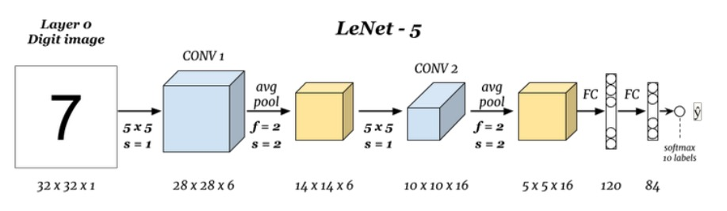

# CNN

## 卷积的基本组件

- 卷积层
- 池化层
- 全连接层

## 卷积的基本特征

- 权值共享
- 局部特征
- 层层递进

## 卷积神经网络概述

### 卷积神经网络的发展规律

- 精度越来越高
- 层次越来越深
- 模型越来越复杂
- 参数越来越多

### 痛点

- 减少计算量和IO，应用到移动端
- 减少冗余，提高泛化能力

## 卷积神经网络的发展

- LeNet (1998)  —— 5层( 2个卷积层3个全连接层  不算池化层)
  - 过拟合
  - 计算量大
- AlexNet(2012) —— 8层( 5个卷积层3个全连接层)
  - 数据增强
  - Dropout
- VGG (2014)
  - 卷机组
  - 卷积变小
- NIN(2014)
  - 多层感知卷积
  - 全局平均池化
- GoogleNet(2014)
  - 卷积分支
  - 1*1的卷积核
  - BN
  - 卷积分解 （采用 1 * 7  7 * 1 的卷积核）
- ResNet(2015)
  - 残差
  - 瓶颈结构

## LeNet

Input Layer：1 * 32 * 32图像
Conv1 Layer：包含6个滤波器，kernal size：5*5，parameters:（5*5+1）*6=156个
Subsampling Layer：average pooling，size：2*2, Activation ：sigmoid
Conv3 Layer：包含16个滤波器，kernal size：5*5 
Subsampling Layer：average pooling，size：2*2
Conv5 Layer：包含120个滤波器，kernal size：5*5
Fully Connected Layer：Activation Function：sigmoid
Output Layer：Gaussian connection

## AlexNet

- 首次使用Rule作为激活函数，极大缓解了梯度消失的问题
- 首次在实践中发挥了dropout的作用，为全连接层加入dropout防止过拟合
- 相较于LeNet-5中采用的平均池化，AlexNet首次采用了重叠的最大池化，避免了平均池化的模糊化效果。
- 提出了LRN层，对局部神经元的活动创建了竞争机制
- 使用多个GPU进行并行计算
- 采用了一定的数据增强手段，一定程度上也缓解了过拟合

AlexNet 不算池化层总共有 8 层，前 5 层为卷积层，其中第一、第二和第五层卷积都包含了一个最大池化层，后三层为全连接层。所以 AlexNet 的简略结构如下：

  输入>卷积>池化>卷积>池化>卷积>卷积>卷积>池化>全连接>全连接>全连接>输出

各层的结构和参数如下：  

#### C1层是个卷积层

输入： 227 x 227 x 3     滤波器大小： 11 x 11 x 3   滤波器个数：96  

输出： 55 x 55 x 96

#### P1层是C1后面的池化层

输入： 55 x 55 x 96  滤波器大小： 3 x 3   滤波器个数：96  

输出： 27 x 27 x 96

#### C2层是个卷积层  

 输入： 27 x 27 x 96  滤波器大小： 5 x 5 x 96   滤波器个数：256 

 输出： 27 x 27 x 256

#### P2层是C2后面的池化层

输入： 27 x 27 x 256  滤波器大小： 3 x 3   滤波器个数：256  

输出： 13 x 13 x 256

#### C3层是个卷积层

输入： 13 x 13 x 256  滤波器大小： 3 x 3 x 256   滤波器个数：384  

输出： 13 x 13 x 384

#### C4层是个卷积层

输入： 13 x 13 x 384  滤波器大小： 3 x 3 x 384   滤波器个数：384  

输出： 13 x 13 x 384

#### C5层是个卷积层 

输入： 13 x 13 x 384  滤波器大小： 3 x 3 x 384    滤波器个数：256  

输出： 13 x 13 x 256

#### P5层是C5后面的池化层

输入： 13 x 13 x 256  滤波器大小： 3 x 3     滤波器个数：256  

输出： 6 x 6 x 256

#### F6层是个全连接层

输入：6 x 6 x 256  

输出：4096

#### F7层是个全连接层

输入：4096  

输出：4096

#### F8层也是个全连接层 

输入：4096  

输出：1000

