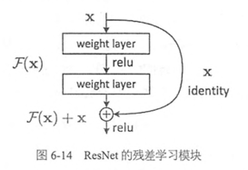
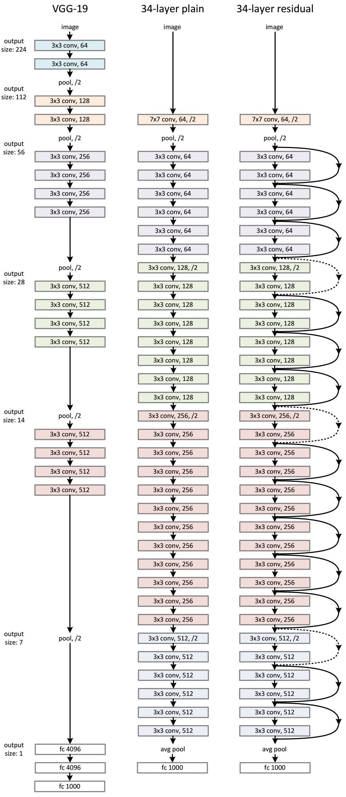
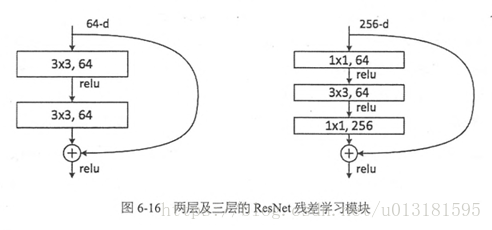
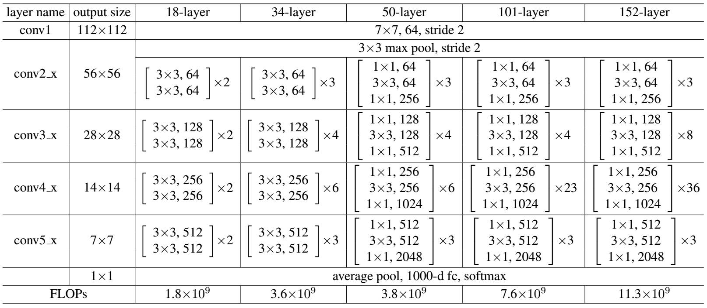

# ResNet

**2015年**

## 简要概括

 	ResNet（Residual Neural Network）由微软研究院的Kaiming He等四名华人提出，通过使用ResNet Unit成功训练出了152层的神经网络，并在ILSVRC2015比赛中取得冠军，在top5上的错误率为3.57%，同时参数量比VGGNet低，效果非常突出。ResNet的结构可以极快的加速神经网络的训练，模型的准确率也有比较大的提升。同时ResNet的推广性非常好，甚至可以直接用到InceptionNet网络中。

​	    ResNet的主要思想是在网络中增加了直连通道，即Highway Network的思想。此前的网络结构是性能输入做一个非线性变换，而Highway Network则允许保留之前网络层的一定比例的输出。ResNet的思想和Highway Network的思想也非常类似，允许原始输入信息直接传到后面的层中，如下图所示。

 

   这样的话这一层的神经网络可以不用学习整个的输出，而是学习上一个网络输出的残差，因此ResNet又叫做残差网络。

 

## 创新点

 	提出残差学习的思想。传统的卷积网络或者全连接网络在信息传递的时候或多或少会存在信息丢失，损耗等问题，同时还有导致梯度消失或者梯度爆炸，导致很深的网络无法训练。ResNet在一定程度上解决了这个问题，通过直接将输入信息绕道传到输出，保护信息的完整性，整个网络只需要学习输入、输出差别的那一部分，简化学习目标和难度。VGGNet和ResNet的对比如下图所示。ResNet最大的区别在于有很多的旁路将输入直接连接到后面的层，这种结构也被称为shortcut或者skip connections。

## 网络结构

    在ResNet网络结构中会用到两种残差模块，一种是以两个3*3的卷积网络串接在一起作为一个残差模块，另外一种是1*1、3*3、1*1的3个卷积网络串接在一起作为一个残差模块。他们如下图所示。

    ResNet有不同的网络层数，比较常用的是50-layer，101-layer，152-layer。他们都是由上述的残差模块堆叠在一起实现的。

