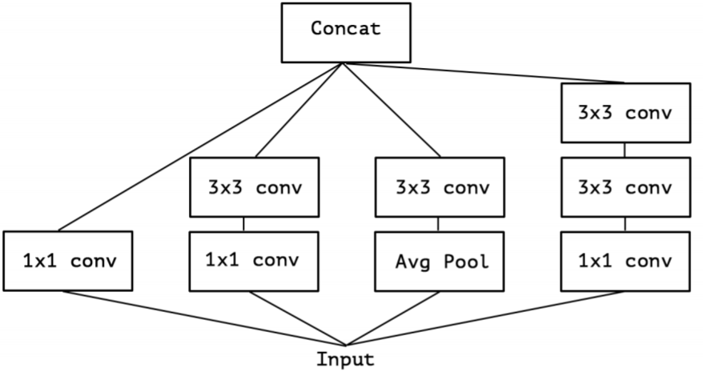
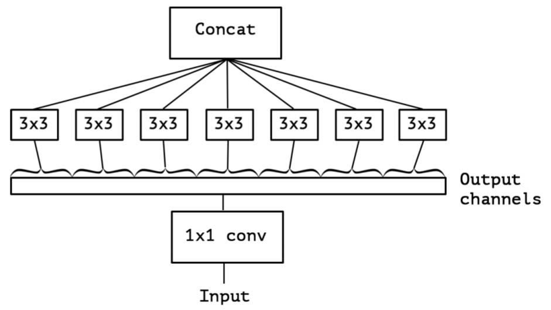
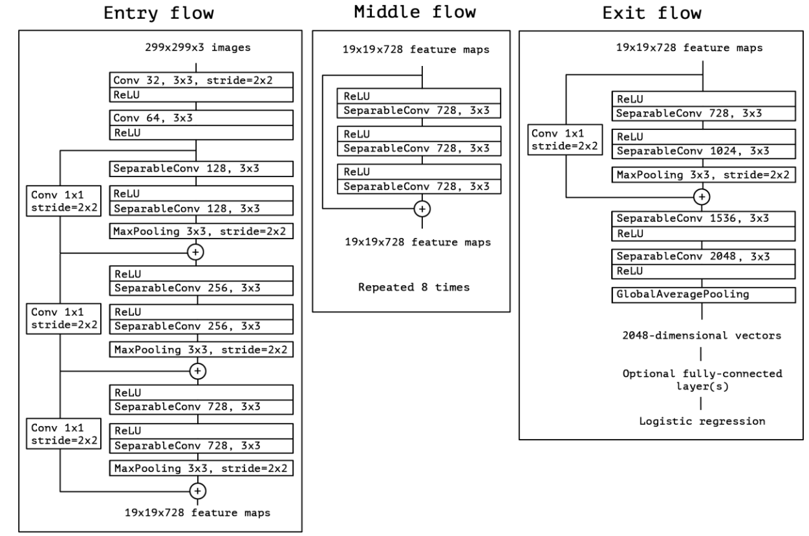

# Xception

**2018年**

[博客原地址===](https://blog.csdn.net/lk3030/article/details/84847879)

### Inception

在 Inception 中，特征可以通过 1×1
1×1 卷积，3×3
3×3 卷积，5×5
5×5 卷积，pooling 等进行提取，Inception 结构将特征类型的选择留给网络自己训练，也就是将一个输入同时输给几种提取特征方式，然后做 concat 。Inception-v3的结构图如下: 

### 极致的 Inception

### Depthwise Separable Convolution 与 极致的 Inception 区别：

- 极致的 Inception：
  - 第一步：普通 1×1 卷积。
  - 第二步：对  1×1 卷积结果的每个 channel，分别进行 3×3 卷积操作，并将结果 concat。
- Depthwise Separable Convolution：
  - 第一步：Depthwise 卷积，对输入的每个channel，分别进行 3×3  卷积操作，并将结果 concat。
  - 第二步：Pointwise 卷积，对 Depthwise 卷积中的 concat 结果，进行 1×1 卷积操作。

### Xception 网络架构

