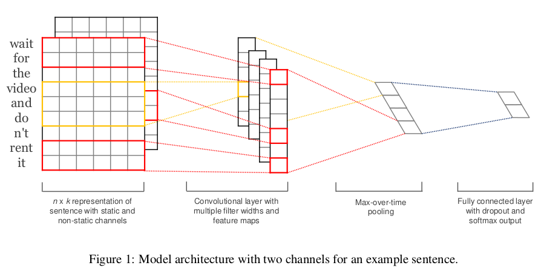
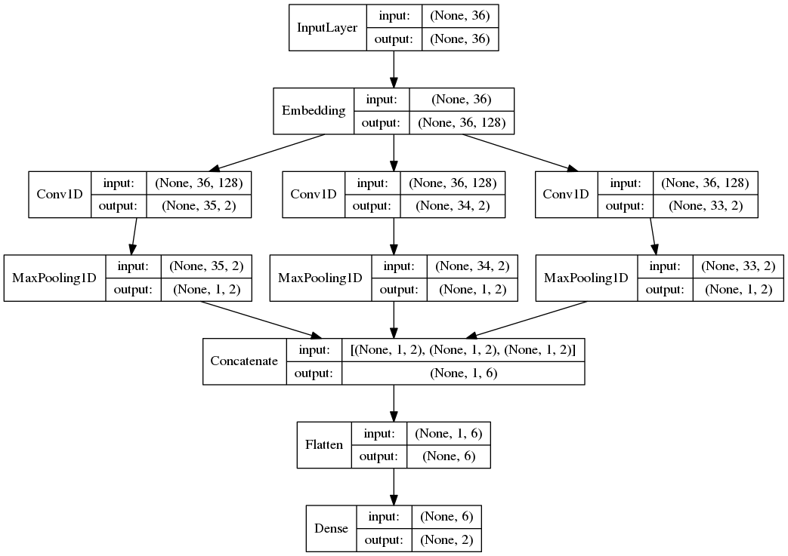

# TextCNN

[ 原博客： NLPTextCNN模型原理和实现](https://www.cnblogs.com/bymo/p/9675654.html) 


## 模型原理


将**卷积神经网络CNN**应用到**文本分类**任务，利用**多个不同size的kernel**来提取句子中的关键信息（类似于多窗口大小的ngram**）**，从而能够更好地捕捉局部相关性。


**网络结构**



TextCNN的详细过程原理图如下：

 **注意filters 和feature maps的区别**


TextCNN详细过程：

- **Embedding**：第一层是图中最左边的7乘5的句子矩阵，每行是词向量，维度=5，这个可以类比为图像中的原始像素点。
- **Convolution**：然后经过 kernel_sizes=(2,3,4) 的一维卷积层，每个kernel_size 有两个输出 channel。
- **MaxPolling**：第三层是一个1-max pooling层，这样不同长度句子经过pooling层之后都能变成定长的表示。
- **FullConnection and Softmax**：最后接一层全连接的 softmax 层，输出每个类别的概率。

一维卷积（conv-1d）：

- 图像是二维数据；
- **文本是一维数据，因此在TextCNN卷积用的是一维卷积**（在**word-level**上是一维卷积；虽然文本经过词向量表达后是二维数据，但是在embedding-level上的二维卷积没有意义）。一维卷积带来的问题是需要**通过设计不同 kernel_size 的 filter 获取不同宽度的视野**。

 Pooling层：

利用CNN解决文本分类问题的文章还是很多的，比如这篇 [A Convolutional Neural Network for Modelling Sentences](https://link.zhihu.com/?target=https%3A//arxiv.org/pdf/1404.2188.pdf) 最有意思的输入是在 pooling 改成 **(dynamic) k-max pooling** ，pooling阶段保留 k 个最大的信息，保留了全局的序列信息。

比如在情感分析场景，举个例子：

```
“我觉得这个地方景色还不错，但是人也实在太多了”
```

 虽然前半部分体现情感是正向的，全局文本表达的是偏负面的情感，利用 k-max pooling能够很好捕捉这类信息。


## 实现

基于**Keras**深度学习框架的实现代码如下：

import logging

from keras import Input
from keras.layers import Conv1D, MaxPool1D, Dense, Flatten, concatenate, Embedding
from keras.models import Model
from keras.utils import plot_model


def textcnn(max_sequence_length, max_token_num, embedding_dim, output_dim, model_img_path=None, embedding_matrix=None):
    """ TextCNN: 1. embedding layers, 2.convolution layer, 3.max-pooling, 4.softmax layer. """
    x_input = Input(shape=(max_sequence_length,))
    logging.info("x_input.shape: %s" % str(x_input.shape))  # (?, 60)

```python
if embedding_matrix is None:
    x_emb = Embedding(input_dim=max_token_num, output_dim=embedding_dim, input_length=max_sequence_length)(x_input)
else:
    x_emb = Embedding(input_dim=max_token_num, output_dim=embedding_dim, input_length=max_sequence_length,
                      weights=[embedding_matrix], trainable=True)(x_input)
logging.info("x_emb.shape: %s" % str(x_emb.shape))  # (?, 60, 300)

pool_output = []
kernel_sizes = [2, 3, 4] 
for kernel_size in kernel_sizes:
    c = Conv1D(filters=2, kernel_size=kernel_size, strides=1)(x_emb)
    p = MaxPool1D(pool_size=int(c.shape[1]))(c)
    pool_output.append(p)
    logging.info("kernel_size: %s \t c.shape: %s \t p.shape: %s" % (kernel_size, str(c.shape), str(p.shape)))
pool_output = concatenate([p for p in pool_output])
logging.info("pool_output.shape: %s" % str(pool_output.shape))  # (?, 1, 6)

x_flatten = Flatten()(pool_output)  # (?, 6)
y = Dense(output_dim, activation='softmax')(x_flatten)  # (?, 2)
logging.info("y.shape: %s \n" % str(y.shape))

model = Model([x_input], outputs=[y])
if model_img_path:
    plot_model(model, to_file=model_img_path, show_shapes=True, show_layer_names=False)
model.summary()
return model
```
plot_model()画出的TextCNN模型结构图如下：



