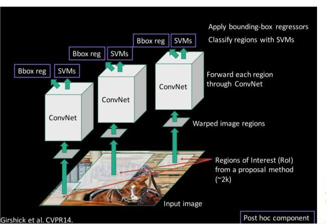
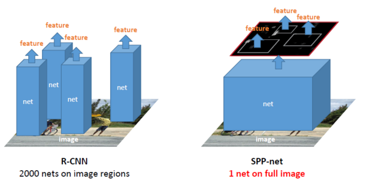
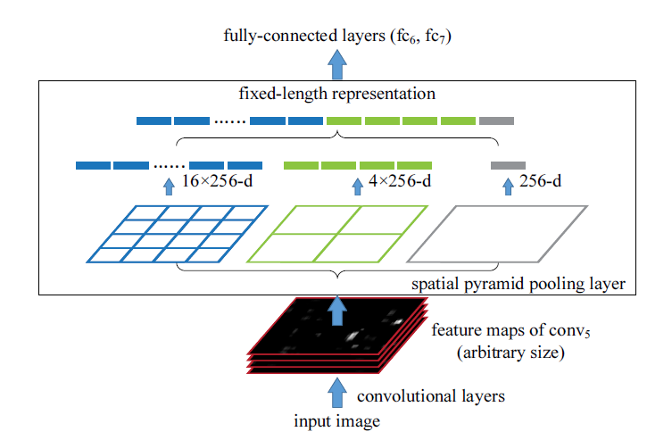
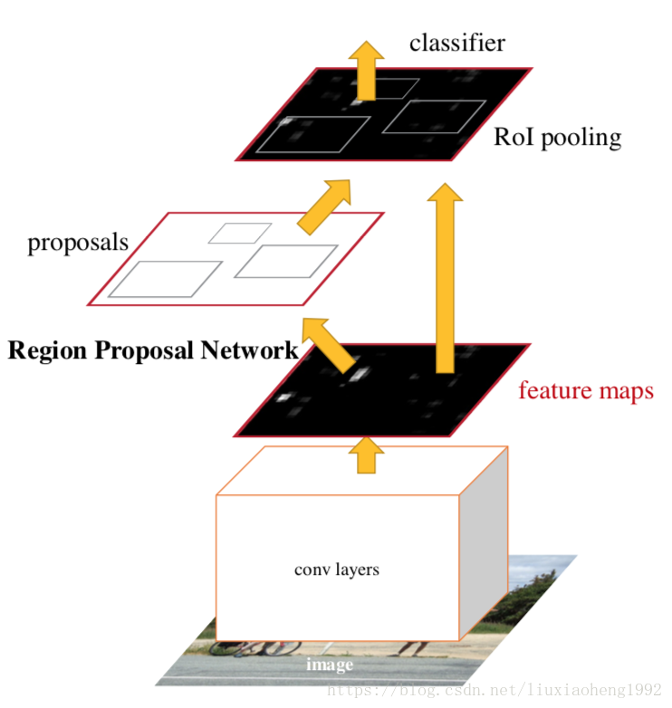
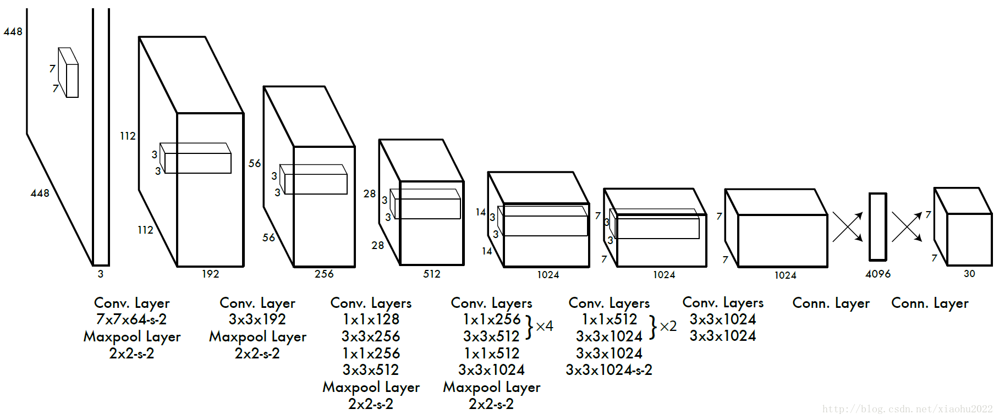
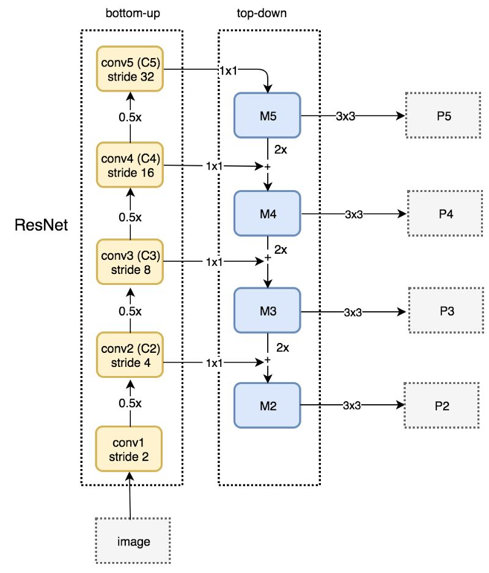
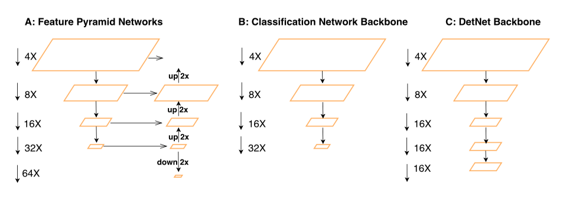

# 目标检测网络

## R-CNN

获选区域(Region Proposal)选取：Selective Search

- 给定一张输入图片，从图片中提取 2000 个类别独立的候选区域。
- 对于每个区域利用 CNN 抽取一个固定长度的特征向量。
- 再对每个区域利用 SVM 进行目标分类。

## SPP Net

获选区域(Region Proposal)选取：Selective Search

- 共享卷积网络
- 采用金字塔池化解决图片尺寸不一的问题

## Fast R-CNN

获选区域(Region Proposal)选取：Selective Search

- ROI pooling layer 对图片大小不一进行处理

- 采用全连接层做分类和回归

  

  

  

## Faster R-CNN

获选区域(Region Proposal)选取：Region Proposal Network（特征输入共享分类特征提取CNN）

- 设定多个anchor box

### YOLO v1

### YOLO v2

- 不在限制于 7 * 7 * 2 个检测目标 
- 添加了BN层，map提高了2%。
- 用448x448的输入分辨率在ImageNet上进行参数微调，map提高了4%。
- 把全连接层取消，使用anchor boxes来预测目标方框；使用anchor boxes的话就把分类置信度和空间位置分离了，所以对每个预测方框都可以回归一个方框置信度和分类置信度。不用anchor box时map是69.5%，召回率是81%，使用了之后map是69.2%召回率是88%。
- 用k-means来选择好的方框先验。
- 对于每个方格，预测5个方框。假设方格的位置是，预测回归的值是，那么实际的方框位置如下。这种方式将map提高了5%。
- 把26x26x512的feature-map，相邻特征分到不同的channel中，因此得到13x13x2048的feature-map，与后面层进行concat，使得map提高了1%。
- 多scale的训练，因为网络为全卷积层，所以同样的网络可以预测不同分辨率的输入，每10个batch随机选择一个新的image size。

##### 新的分类网络Darknet-19 

## YOLO v3

- 用logistic regression对方框置信度进行回归，对先验与实际方框IOU大于0.5的作为正例，与SSD不同的是，若有多个先验满足目标，只取一个IOU最大的先验。
- 对每个类别独立地使用logistic regression，用二分类交叉熵损失作为类别损失，可以很好地处理多标签任务。
- 利用多个scale进行预测，实际使用3个不同的scale。将前两层的feature-map进行上采样，与开始的feature-map进行concat起来，加一些卷积层，然后进行预测。

##### 

 ## SSD

- 多尺度

- 设置了多种宽高比的default box(anchor box)  
- 数据增强 

 

## FPN

- 图像金字塔

 

 

 

## DetNet

