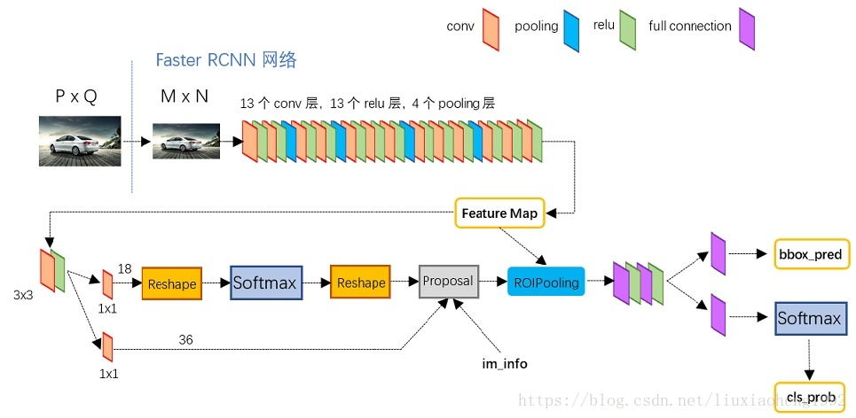
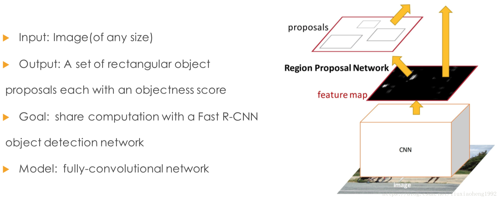
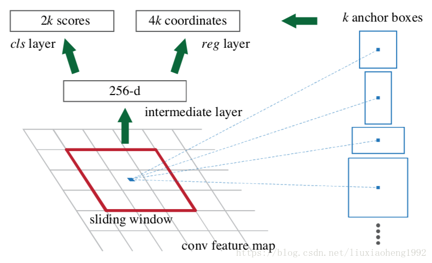
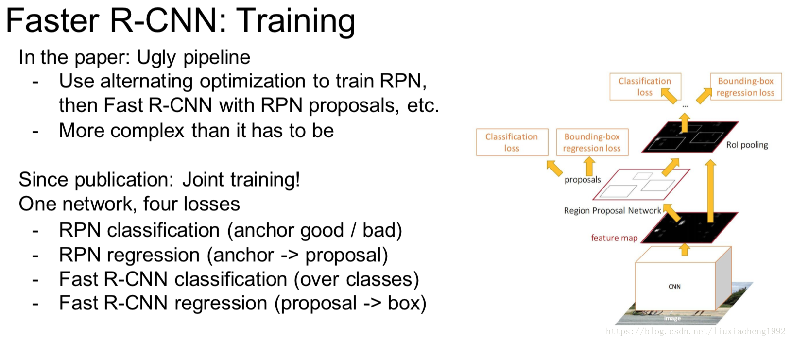

# Faster R-CNN

Faster R-CNN的整体结构，如下图所示 

更为详细的图，如下 

通过上面两张图可以看出Faster R-CNN由四个部分组成： 
1）卷积层(conv layers)，用于提取图片的特征，输入为整张图片，输出为提取出的特征称为feature maps 
2）RPN网络(Region Proposal Network)，用于推荐候选区域，这个网络是用来代替之前的search selective的。输入为图片(因为这里RPN网络和Fast R-CNN共用同一个CNN，所以这里输入也可以认为是featrue maps)，输出为多个候选区域，这里的细节会在后面详细介绍。 
3）RoI pooling，和Fast R-CNN一样，将不同大小的输入转换为固定长度的输出，输入输出和Faste R-CNN中RoI pooling一样。 
4）分类和回归，这一层的输出是最终目的，输出候选区域所属的类，和候选区域在图像中的精确位置。

## **RPN** 

通过上述介绍可以知道，Faster R-CNN与Fast R-CNN最大的区别就是提出了一个叫RPN(Region Proposal Networks)的网络，专门用来推荐候选区域的，RPN可以理解为一种全卷积网络，该网络可以进行end-to-end的训练，最终目的是为了推荐候选区域，如下图所示。

原文中RPN网络为CNN后面接一个3*3的卷积层，再接两个1*1的卷积层(原文称这两个卷积层的关系为sibling)，其中一个是用来给softmax层进行分类，另一个用于给候选区域精确定位。

到这里其实有个疑问没有说清楚，也算是理解这篇文章的重点，通过CNN得到的feature map怎么可以通过RPN得到与原图对应的候选区域的，换句话说，RPN输出的候选区域和softmax的结构怎么与原图中的区域进行对应的。要解决这个疑问就得先理解anchors的概念。

**anchors**

anchors可以理解为一些预设大小的框，anchors的种类用k表示，在原文中k=9，由3种面积(1282,2562,5122
)和3种长宽比(1:1,1:2,2:1)组成，这里anchors的大小选取是根据检测时的图像定义，在检测时会将最小边缩放到600，最大边不超过1000（我看的是tf版本的代码）。生成anchors如下

[[ -84.  -40.   99.   55.]
 [-176.  -88.  191.  103.]
 [-360. -184.  375.  199.]
 [ -56.  -56.   71.   71.]
 [-120. -120.  135.  135.]
 [-248. -248.  263.  263.]
 [ -36.  -80.   51.   95.]
 [ -80. -168.   95.  183.]
 [-168. -344.  183.  359.]] 
因为提出的候选区域是在原图上的区域，所以要清楚anchors在原图中的位置。假设CNN得到的feature map大小为w∗h，那总的anchors个数为9∗w∗h，9为上述的9种anchors。假设原图大小为W∗H，由SPP-net文章详细解读知W=S⋅w,H=S⋅s，S为之前所有层的stride size相乘，所以feature map上的点乘以S即为anchors的原点位置，得到所有框的原点位置以及大小就可以得到原图上的anchors区域了。

那RPN的输出跟anchors是什么关系呢，通过下图进行讨论 

解释一下上面这张图：

1）在原文中使用的是ZF model中，其Conv Layers中最后的conv5层num_output=256，对应生成256张特征图(feature maps)，所以相当于feature map每个点都是256-dimensions 
2）在conv5之后，做了rpn_conv/3x3卷积且num_output=256，相当于每个点又融合了周围3x3的空间信息），同时256-d不变 
3）假设在conv5 feature map中每个点上有k个anchor（原文如上k=9），而每个anhcor要分foreground和background，所以每个点由256d feature转化为cls=2k scores；而每个anchor都有[x, y, w, h]对应4个偏移量，所以reg=4k coordinates（scores和coordinates为RPN的最终输出） 
4）补充一点，全部anchors拿去训练太多了，训练程序会在合适的anchors中随机选取128个postive anchors+128个negative anchors进行训练(至于什么是合适的anchors接下来RPN的训练会讲)

注意，在tf版本的代码中使用的VGG conv5 num_output=512g，所以是512d，其他类似。

## RPN训练

RPN训练中对于正样本文章中给出两种定义。第一，与ground truth box有最大的IoU的anchors作为正样本；第二，与ground truth box的IoU大于0.7的作为正样本。文中采取的是第一种方式。文中定义的负样本为与ground truth box的IoU小于0.3的样本。 
训练RPN的loss函数定义如下： 
L({pi},{ti})=1Ncls∑iLcls(pi,p∗i)+λ1Nreg∑ip∗iLreg(ti,t∗i)

其中，i表示mini-batch中第i个anchor，pi
表示第i个anchor是前景的概率，当第i个anchor是前景时p∗i
为1反之为0，ti
表示预测的bounding box的坐标，t∗i
为ground truth的坐标。 
看过Fast R-CNN文章详细解读文章的会发现，这部分的loss函数和Fast R-CNN一样，除了正负样本的定义不一样，其他表示时一样的。

 ## **RPN网络与Fast R-CNN网络的权值共享** 

RPN最终目的是得到候选区域，但在目标检测的最终目的是为了得到最终的物体的位置和相应的概率，这部分功能由Fast R-CNN做的。因为RPN和Fast R-CNN都会要求利用CNN网络提取特征，所以文章的做法是使RPN和Fast R-CNN共享同一个CNN部分。 
Faster R-CNN的训练方法主要分为两个，目的都是使得RPN和Fast R-CNN共享CNN部分，如下图所示 

一个是迭代的，先训练RPN，然后使用得到的候选区域训练Fast R-CNN，之后再使用得到的Fast R-CNN中的CNN去初始化RPN的CNN再次训练RPN(这里不更新CNN，仅更新RPN特有的层)，最后再次训练Fast R-CNN(这里不更新CNN，仅更新Fast R-CNN特有的层)。 
还有一个更为简单的方法，就是end-to-end的训练方法，将RPN和Fast R-CNN结合起来一起训练，tf版本的代码有这种方式的实现。

