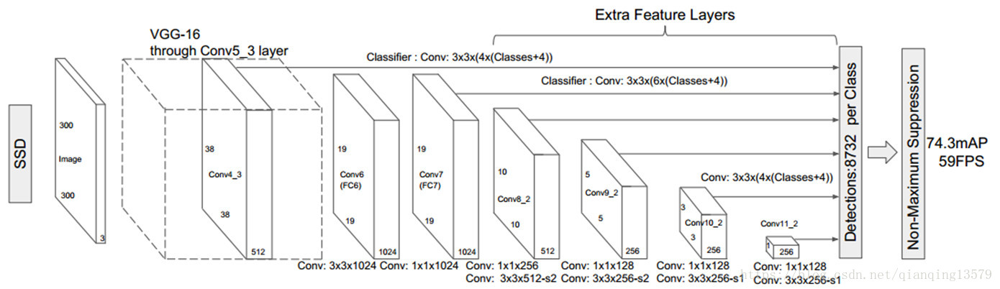
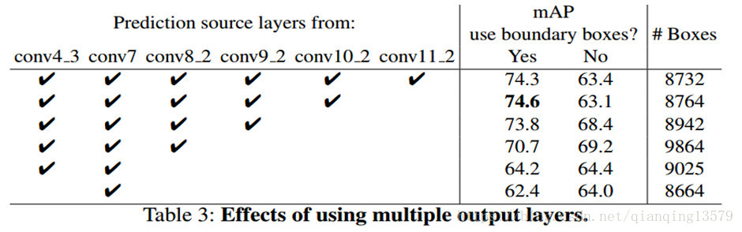
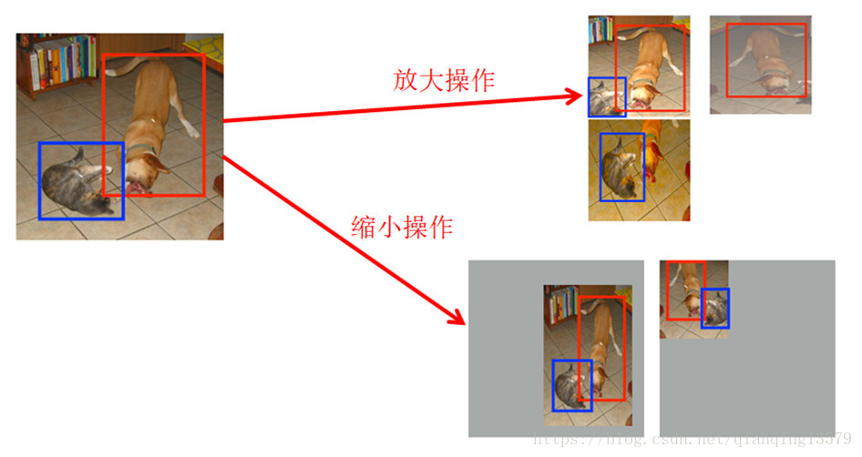
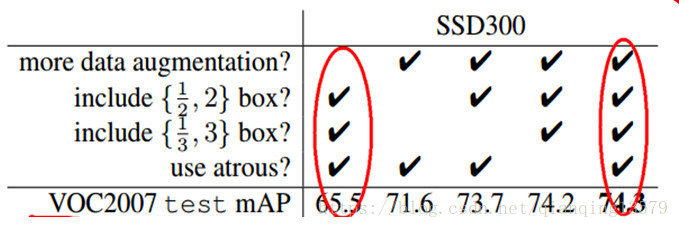

# SSD

[博客原地址=========](https://blog.csdn.net/qianqing13579/article/details/82106664)

## SSD效果为什么这么好

虽然SSD这个算法出来已经两年了，但是至今依旧是目标检测中应用最广泛的算法，虽然后面有很多基于SSD改进的算法，但至今也没有哪一种检测算法在速度和精度上能够完全碾压SSD的。那么为什么SSD效果这么好？SSD效果好主要有三点原因： 

- 多尺度  
- 设置了多种宽高比的default box(anchor box)  
- 数据增强 

### 多尺度

由SSD的网络结构可以看出，SSD使用6个不同特征图检测不同尺度的目标。低层预测小目标，高层预测大目标。

作者在论文中通过实验验证了，采用多个特征图做检测能够大大提高检测精度，从上面的表格可以看出，采用6个特征图检测的时候，mAP为74.3%,如果只采用conv7做检测，mAP只有62.4%。

### 设置了多种宽高比的default box

在特征图的每个像素点处，生成不同宽高比的default box(anchor box),论文中设置的宽高比为{1,2,3,1/2,1/3}。假设每个像素点有k个default box，需要对每个default box进行分类和回归，其中用于分类的卷积核个数为c*k(c表示类别数)，回归的卷积核个数为4*k。

SSD300中default box的数量:（38 * 38 * 4 + 19 * 19 * 6 + 10 * 10 * 6 + 5 * 5 * 6 + 3 * 3 * 4 + 1 * 1 * 4）= 8732

讲到这里，我想对于刚学习SSD的朋友，一定有这些疑惑： 

1. 为什么要设置default box?  
2. 为什么要设置多种宽高比的default box?  
3. 为什么在6个特征图上使用3x3的卷积核进行卷积就可以做检测了呢？ 

这些问题曾经困恼我很长时间，当我看完SSD的源码，并通过很长时间的实践，对这些问题豁然开朗，下面分享自己对这些问题的一些理解，希望对你理解SSD能够提供一些帮助。

…….

### 数据增强

SSD中使用了两种数据增强的方式  

**放大操作**: 随机crop，patch与任意一个目标的IOU为0.1,0.3,0.5,0.7,0.9，每个patch的大小为原图大小的[0.1,1],宽高比在1/2到2之间。能够生成更多的尺度较大的目标  

**缩小操作**: 首先创建16倍原图大小的画布，然后将原图放置其中，然后随机crop，能够生成更多尺度较小的目标

# SSD的缺点及改进

SSD主要缺点：SSD对小目标的检测效果一般，作者认为小目标在高层没有足够的信息。

对SSD的改进可以从下面几个方面考虑： 

  1. 增大输入尺寸  
  2. 使用更低的特征图做检测  
  3. 设置default box的大小，让default box能够更好的匹配实际的有效感受野

