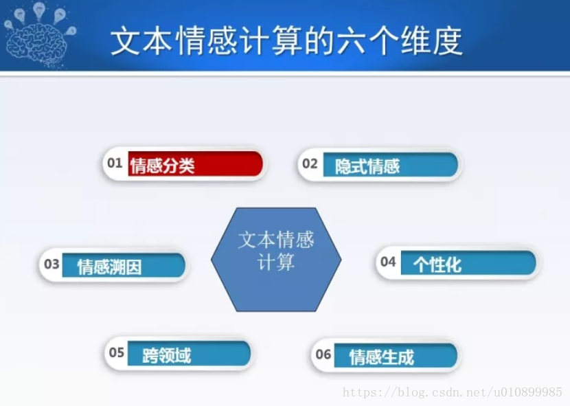

# 文本情感分析

从情感计算的六个维度来讲

### **一，情感分类**

首先从情感分类的角度出发，比如说人类的情感是多样性的，我们经常能想起来的词或者看到的词，比如喜极而泣，抱头痛哭，捶胸顿足，七情六欲，五味杂陈等等，表达了我们的喜怒哀乐。实际上多年来也有很多人在这方面做了很多研究，比如七情六欲分为好，恶，乐，怒，哀，惧，欲等。此外，还有人从高兴，悲伤，愤怒，恐惧，厌恶，惊奇等进行分类。

对于情感分类，**一般来讲有粗粒度情感分类照片，度粗粒情感分类照片主要用来判断字幕：本世纪的牛顿情感倾向**，表明一个人对某件事或对某个物体的整体评价。情感计算中大多采用两种，一种是倾向性分类，即褒，贬，中的分类，还有一种是微博中经常出现的情绪分类，表示个人主观情绪的喜，怒，悲，恐，惊。

有了这么多类别体系，又有倾向性分类或情绪分类，分别针对我们对不同的产品，不同的服务，甚至表达的是我们个人的不同情感，无论它怎么划分或者划分的颗粒度有多细，总体来讲它是一个分类任务，传也就是说**统的字幕：分类照片任务适用于情感分类照片，的字幕：情感分类照片可以看成的英文一种特殊的字幕：分类照片任务**。那么传统文本分类是通过训练样本，特征提取+机器学习模型，训练好参数，对未知样本进行分类预测。对于情感分类，考虑到特定的情感资源，相对于传统文本分类，有了更多可利用的知识。

随着深度学习的发展，也给文本情感分类带来很多生机。这些年出现很多关于深度学习和情感分析相结合的情感类别预测任务。在深度学习过程当中可以加入情感资源，包括语言学的约束，情感辞典的信息，加入之后可以使情感分类和深度学习结合得更充分。

刚才讲的是粗粒度分类，便于我们从整体上把握用户对情感，对世界，对产品的整体倾向。一种还有叫分类照片**细粒度情感分类照片，细粒度所谓即针对评价对象及其属性的情感倾向**，比如“iPhone10很不错，除了贵，买不起，新的iWatch可以买一个，跑步就不要带手机了”。这里面有两个评价对象，第一个评价对象的评价是iPhone很不错，但是很贵，在购买不购买上持否定态度，对于iWatch来讲，评价对象认为跑步时可以不用带手机，所以相对于iPhone来讲，更倾向于买iWatch。我们做细粒度情感分析时就要分别把不同的评价对象抽取出来，把评价词语，情感类别分别判定出来，这样我们就可以细粒度分析一个产品，服务甚至情感。

当然，这种分类任务要结合文本当中不同的评价对象，所以**面向评价对象的情感分类有很多种方法，解词比较的可以利用上下文信息，神经采用网络中的注意力机制，使某个评价对象和词语能更好地寻找到搭配，从而来判断。我们在EMNLP2016 上发表的一篇论文就介绍了我们的成果。**

面向评价对象的情感分类，可以落地很多应用，比如现在网络上有很多文本，海量的评论，比如评论手机，具体来讲是华为手机，我们在评论时按照细粒度分类，可以把评价对象，评价词，属性抽取出来，进一步构建出评价手机体系的维度空间，也就是说你可能事先对某一个产品或某一个分类不知道从哪些角度去了解它，或者从哪些维度去分析它，但我们可以通过细粒度情感分类把这个体系归纳出来，同时对每一个粒度进行打分，比如图中红色和蓝色的区别就是褒贬，颜色的不同表示它们打分值，这样用户可以在购买时进行评价，比如华为手机，苹果手机或其他类型的手机。同时我们还可以把这些评论总结出来，比如评论的极性分布，刚才是细粒度的，总体来讲有多少人是评价正面的，有多少人评价是负面的，这是粗粒度的，这些都可以给用户提 全方位评价体验。

粗粒度情感分类是为商家了解用户对产品的评论，政府了解公众舆情提供参考。细粒度情感分类可以提供所评价的产品或服务的精准画像，为商家和用户提供不同的评估。

### **二，隐式情感**

无论是你听别人的话，还是自己表达情感时，可能未必会使用情感词。**情感表达中有20％-30％是没有情感词的，它属于隐式情感**，而隐式情感多使用事实型陈述和语言修辞表达，**从隐式情感分布来讲，有事实型，有比喻型，有反问型，其中事实型情感占72％**。采用事实型情感，比如一个人住到酒店，他在发微博时说“桌子上有一层灰”，这没有任何情感词，但实际上已经表达了他的不满，这就是事实型表述。再看褒义描述，“从下单到收到货不到24小时”，表明他称赞快递速度很快，但没有明显的表达词，这些都属于事实型表述。

这种事实型描述怎么挖掘？这种事实型表述出现很频繁，时候这个我们可以**采用上下文**，比如我说“桌子上有一层灰，很不高兴”，就可以把“桌子上有一层灰”定义为贬义的。**或者找不到上下文的话，可以也。在其他文当中找到跟它形容词：的语句，再判定情感，通过借助周围上下文的分析进行推理，得到这句话的情感，这是一种解决策略**。同时，也。我们可以**借助外部知识**，比如快递多长时间算快，或者说这个人身高1.8米，我们有个常识，一米几以上就算高个儿，类似这样的知识可以帮助我们进行隐式情感分析。

除了事实型之外，还有一种是修辞型的，修辞型的更难区分，“拿机器人和人相比，‘你咋这么聪明呢？’平常你可以听到别人这么夸你或者这么讽刺你，但有的时候光看语言的话，我们很难判定是夸你聪明还是笨。此外，还有**隐喻**的方式，比如一个人去旅游胜地爱琴海，他在描述中说“此乃西方文明的摇篮“，这就是一种比喻，这种比喻包含很多赞赏，这种修辞型怎么表达出来？怎么或者把大量的存在于我们生活当中的**隐式情感挖掘出来，这需要很多外部知识，从资源的角度来讲，理工大连大学林鸿飞老师有一些隐喻语料库，大学山西王素格老师有一些隐式情感语料库，分别对事实型和修辞型隐**式情感提供了一定帮助。当然，语料库只是提供某些支持，隐式情感是一种含蓄的表达方式，隐式情感表达因为缺少情感词的指引，所以需要寻找新的特 与表示方法。而且要结合目标，比如我们说到玫瑰花，红豆，月亮，说到这些词的时候会联想到哪些情感，这些和知识和上下文都会通过分析推理获得隐式情感的语义。

### **三，情感溯因**

 

分析情感的目的是什么？这些情感产生的原因又是什么？比如他是因为什么高兴，因为什么伤心，因为什么愤怒，我们需要情感溯因，也为了大家更好地观察产品，体会服务以及体察对方的情感。从原因来看，一般是“情”出有因，这里有一个例子看着懂事的女儿每天被病痛折磨着，自己却不能为她捐肾，想到自己无能为力，张志英泣不成声。”我们可以进行溯因，也就是要知其然，也要知其所以然，知道了原因之后，比如你知道一个人有洁癖，忍受不了桌子上有一层灰，下次她再看到一个地方的桌子上有一层灰，可能她没有表达出来，但你能预期到她会生气。

文本情感的原因发现方法，比如**哈工大深圳研究院的徐睿峰老师做过一些工作，也有语料库，一般的英文按照类似问答系统-研究的方式，这里面有情感词，有原文，通过记忆网络判别这个文章中哪句话是原因，通过类别判断是或不是**。

另外一种是群体，除了文本情感原因，社交媒体上也有很多值得我们发掘的原因，比如长江邮轮倾覆这件事中有很多悲哀的情绪，但是为什么还会有喜悦的成分呢？大家也会疑惑，我们通过此事件分析，对长江邮轮倾覆事件的喜悦实际上是由于沉船内部有生命迹象和载客458人，救起8人，由这些子事件导致大家觉得有希望的情感，所以表达出来了喜悦，**这也是情感原因的发现方法，社交从媒体上通过子事件进行分析。**

### **四，个性化**

通过进一步分析我们可以知道人和人是不同的，同一对象，不同人立场不同，可能表达出不同情感;相同对象，不同人表达相同情感，用词风格不同比如男生和女生对待某一件事的时候可能分歧很大，所以在情感计算中要加入用户特征，比如**用户画像技术**，这里面包括自然属性，社会属性，兴趣属性，心理属性等。一般立场不同，情感可能会不同，比如去年广为人知的“青岛38元大虾”和“哈尔滨天价鱼”事件，关于青岛38元大虾，“在南方的东北妹子”评价说“米饭按粒卖，我不得不倾家荡产么！”关于哈尔滨天价鱼中的评价是“北方人觉得南方小小气气，南方人觉得北方人没素质”。此外，人们的用词风格也会不同，这里有两个人，一个人很容易用非常夸张的词，比如“这个车太漂亮了”，另一个人会说‘还行吧’，他所说的‘还行吧’对他 来讲就是很好了。我们用两个人发表的文章进行对比，不同的人发表的文章在情感分值差异性上会有不同，用词风格也如此，同一篇文档，比如这个人发表的文档相似度很高，他评价车，评价服装时都会使用很夸张的词。如果跟另外一个人来比较，文章用词的相似度就很低。

**我们在神经网络分类中融入用户和产品的向量和矩阵来表示信息，然后把它融入已有神经网络框架，应用到文本情感分类任务，这一部分内容的论文发表在2015年的ACL上。**

### **五，领域问题**

我们在不同的领域都存在迁移的问题，以图书和电子领域为例，每个领域的评价对象都不同，不同领域的评价表达千差万别，不同领域中的同一情感表达极性不同。比如“简单”这一词，情节简单和上手简单表达的情感就不一样。这需要我们进行跨领域的情感研究，也就是进行模型迁移过程，**通常在情感分析领域的迁移，一是利用领域无关的词和领域词相关的链接关系，再进行分别聚类。在神经网络当中，通过神经网络的隐层参数尽量提取与情感相关，但与领域无关的词的特征来分类。**

### **六，情感生成**

实际上我们一直分析的是人类的情感，我们一直很期待机器是不是能产生情感，也就是说机器有情感吗？有三观吗？目前机器是没有自主意识的，而指定情感类别的情感生成可以做到，我们比如说可以根据**指定的情感类别生成情感表达**，可以也。在**聊天机器人当中根据转移概率进行变换**，也。此外可以对**情感表达进行润色风格状语从句：转换**。

评论文本生成很简单，只要你输入一个用户名，产品名，输入打分，偏好，就可以生成相应的文本情感表达，大家可能会经常会在产品评论中看到一些机器生成的评论，有些时候可以判别出是机器生成的，有的时候判别不出来。

在聊天系统中可以情感回复生成，例如上一句话说“我的狗丢了”，然后生成一个生气的回复，我们在这一部分加入情感类别因素，向量和矩阵叠加起来，生成新词带入到下面，所以生成的下文是“谁让你不管好！”这是明显的表达生气情感回复。

此外，我们可以进行文本的情感极性变换及润色，比如原句是“服务不周，而且极其粗鲁”，可以修改为“服务到位，而且非常清爽。”还可以进行文章的润色，比如“两只狗在树边玩耍”，我们可以把它修改为‘两只狗在树边玩耍，享受童年的快乐’。

情感文本生成迈出机器发出情感的第一步，在聊天系统中可以进行情感互动，自动生成评论文本可以丰富用户的表达方式，比如一个人不善表达，但他对这个东西打分非常好，我们可以帮助他生成一段文字，丰富他的表达方式。

总的来讲，情感分析已经发展了很多年，已经落地产生了很多应用，产生巨大价值，比如在社会舆情方面，电子商务方面，如大家经常看到的淘宝网等等，再比如在传统行业方面，比如帮助ZARA进行服装设计改进，此外在金融等特定领域都发挥了巨大的作用，这是一个很接地气的方向，同时也具有很多技术挑战。

在对话聊天机器人中加入情感互动比较好的，博主有了解到国内竹简科技做的比较好，感兴趣的可以了解。

我们来看一下能否进行诗词鉴赏。例如一个高考题目，关于一首杜甫的诗，“韦曲花无赖，家家恼煞人”，描写春色的美。“绿樽须尽日，白发好禁春”是说在这样的日子需要喝酒，需要好好享受春天的气息。‘石角钩衣破，藤梢刺眼新’描述他已经不顾衣服被石角钩破，欣赏藤梢冒出的新芽。 “何时占丛竹，头戴小乌巾”表达什么时候能头戴小乌巾归隐山林。问题是谈谈诗的最后两句表达了诗人怎样的思想感情。参考答案是对于春色的描述表达出作者的喜爱之情，因此产生对归隐山林的隐士生活的向往。情感分析中用了很多其他技术，包括古诗词，隐喻等等，能表达情感和背后隐藏的归隐山林的心情，什么时候机器的情感分析也能进一步分析出这种情感，同时又能像刚才孙茂松老师介绍的古诗词一样，能够生成带有指定情感的古诗词也是情感分 未来需要探索的。

最后总结一下情感是人类的高级思维方式;机器可以通过学习理解人类的情感模式，了解人类的情感;情感溯因可以帮助更深入理解人类情感动机;机器可以借助指定情感类别方式生成情感文本;鉴赏类或文学作品赏析情感计算值得我们继续探索。真正具有自主意识的情感智能还未到来。

 