# Transformer

## 整体架构

- encoder
  - self-attention 解决long-dependency
  - multi-head 实现dynamic embedding
  - positional encoding 拥有时序模型功能
  - residual network
- decoder
  - encoder-decoder attention
  - decoder self-attention
  - liner-softmax层

**transformer整体架构**

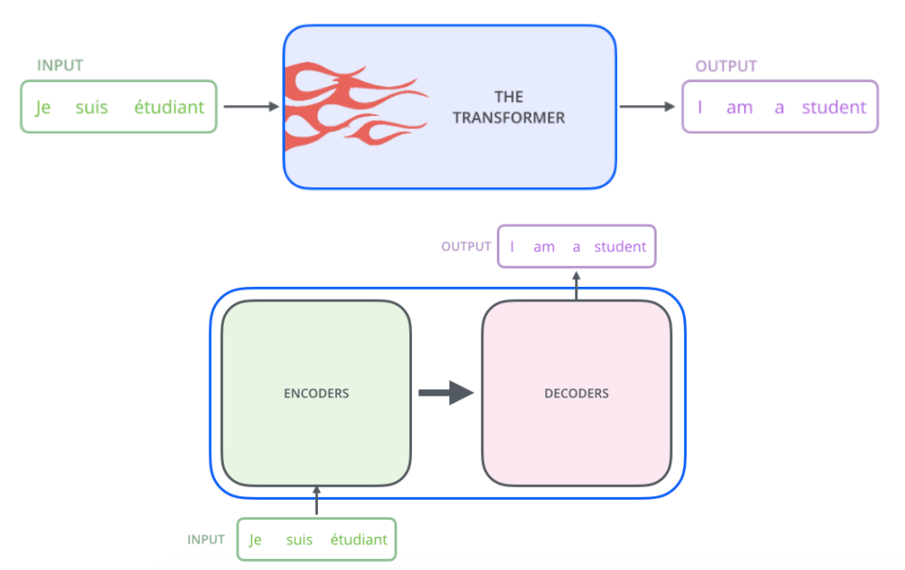

### Self-attention  解决long-dependency

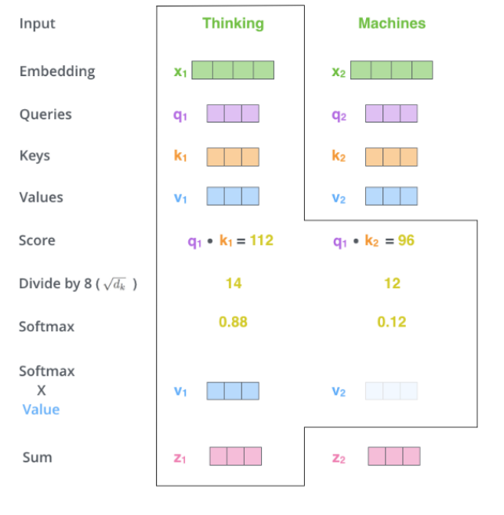

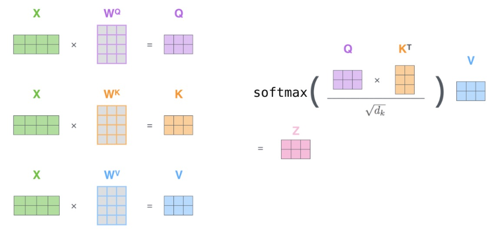

### multi-head  实现dynamic embedding

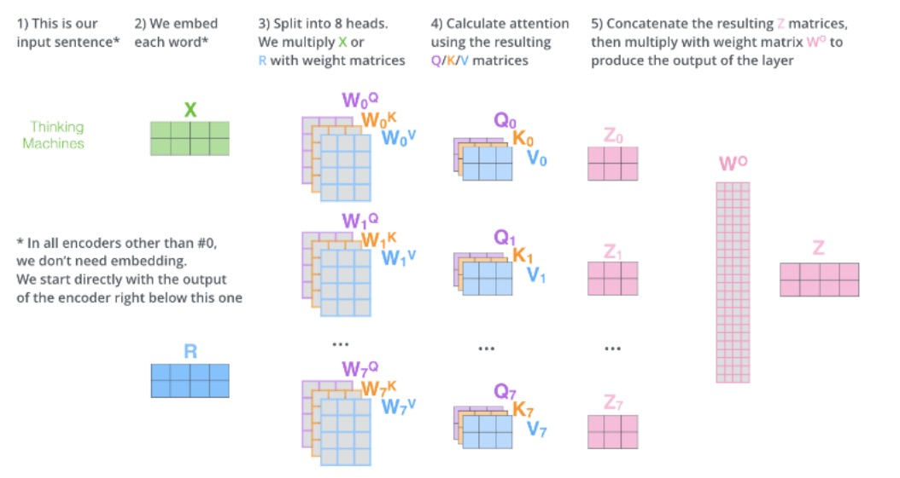

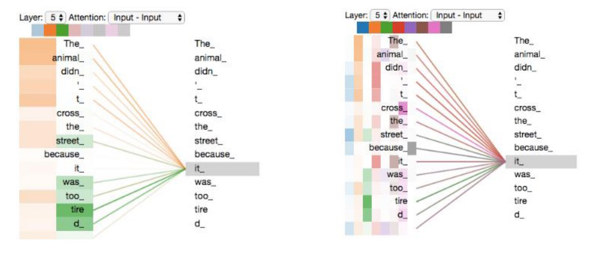

### Positional Encodeing

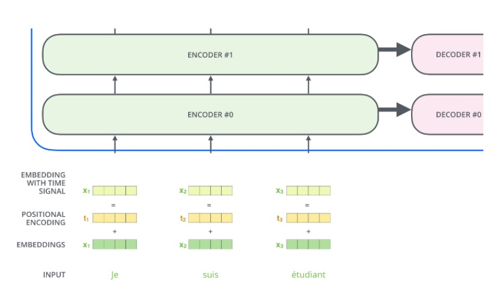

### Residual Network

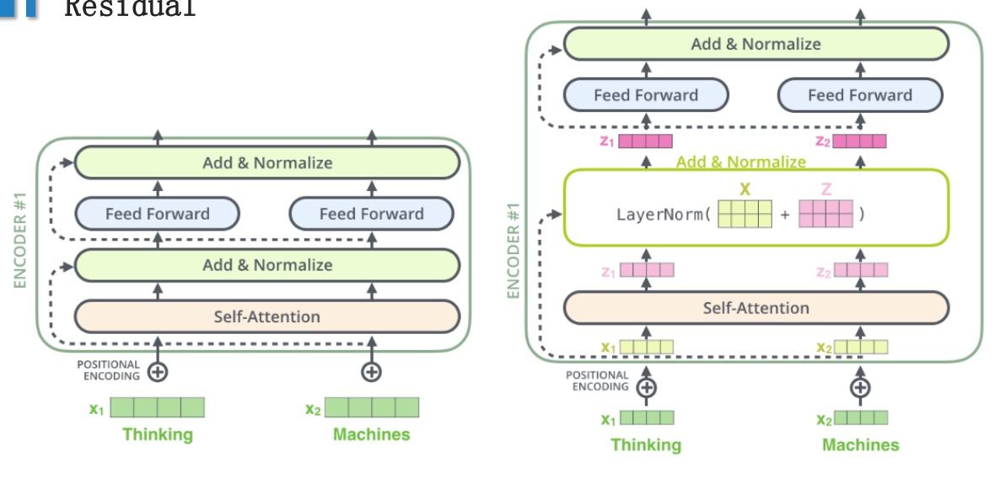

### Encoder-decoder attention

- mask 因为输出的时候只有前面的输出信息(不是所有信息都是满的) 所以才需要mask

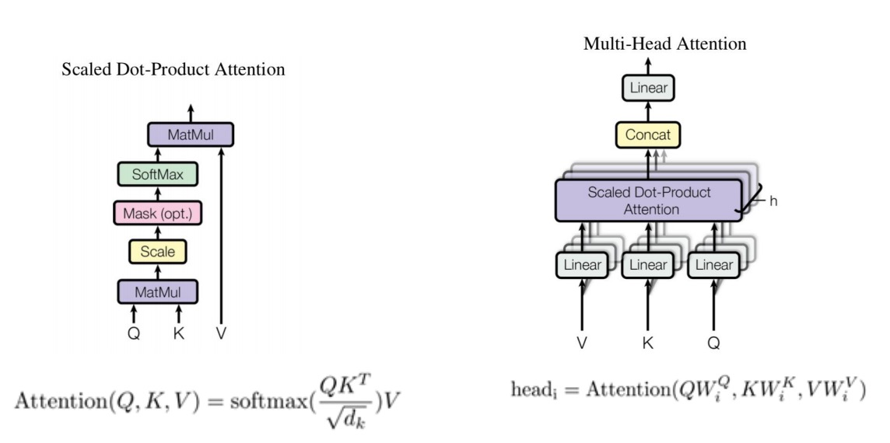

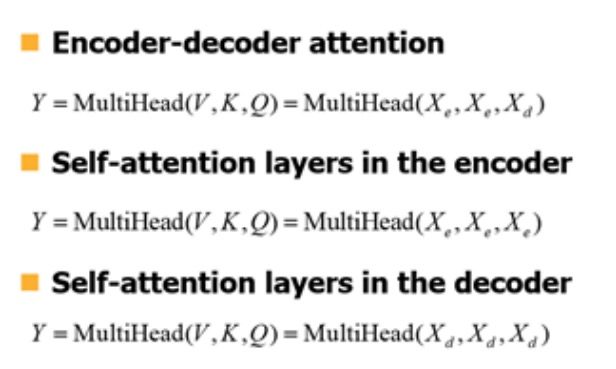

### decoder self-attention

解码器的self-attention与编码器中self-attention(也就是上面讲的self-attention)有所不同。在
解码器中，在self-attention层中仅允许每个词关注目标语言序列中的前序位置。这是通过在
self-attention层中屏蔽后面的位置来完成即通过设置后面词的mask为-inf。mask的在selfattention的位置如下图：

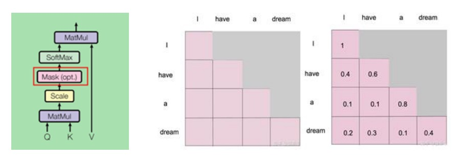

## linear sotfmax

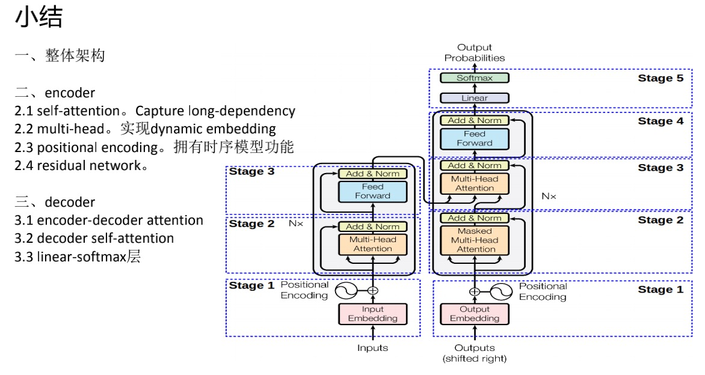

