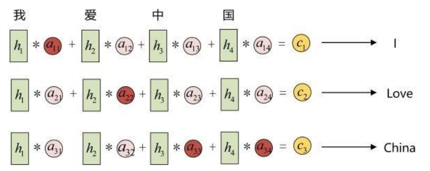
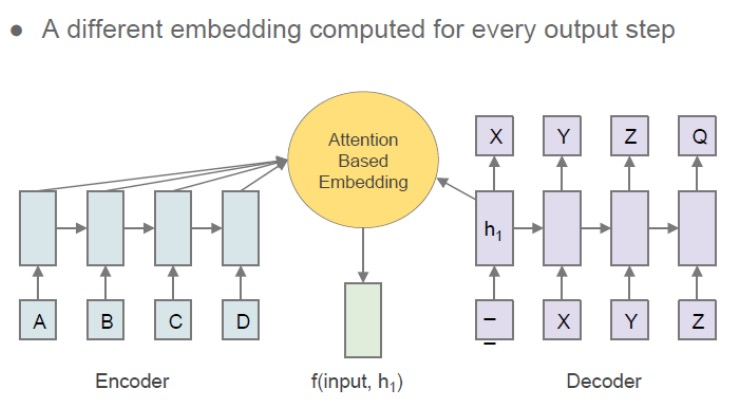
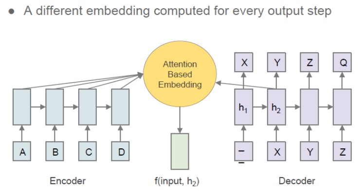
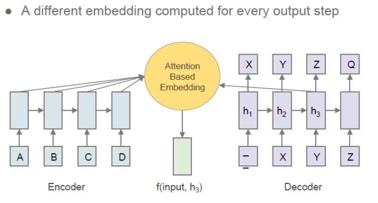
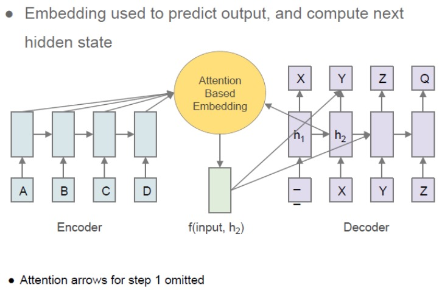
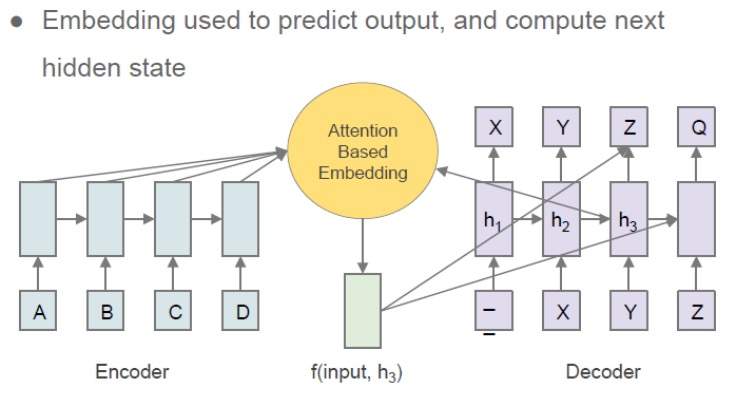
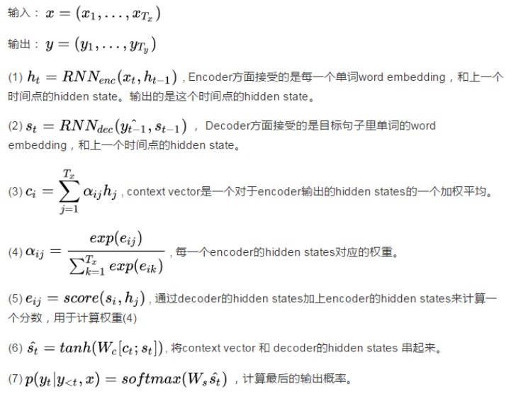

# Attetion

## 为什么要使用Attetion

核心目标是从众多信息中选择出对当前任务目标更关键的信息。

利用有限的注意力资源从大量信息中快速筛选出高价值信

当输入序列非常长时，Encoder-Decoder模型难以学到合理的向量表示：

1、序列输入时，随着序列的不断增长，原始根据时间步的方式的表现越来越差，这是由于原始的这种时间步模型设计的结构有缺陷，即所有的上下文输入信息都被限制到固定长度，整个模型的能力都同样收到限制。
2、使用传统编码器-解码器的RNN模型先用一些LSTM单元来对输入序列进行学习，编码为固定长度的向量表示；然后再用一些LSTM单元来读取这种向量表示并解码为输出序列。它存在一个问题在于：输入序列不论长短都会被编码成一个固定长度的向量表示，而解码则受限于该固定长度的向量表示

## Seq2seq Attention

## Attetion三部曲

- 计算score
- 计算softamax概率
- 计算weighted sum加权和

