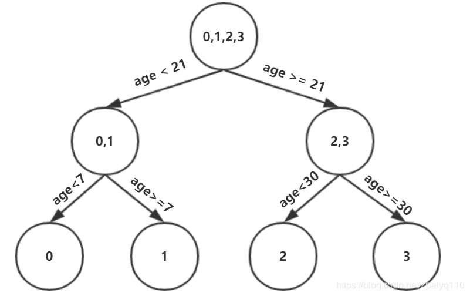
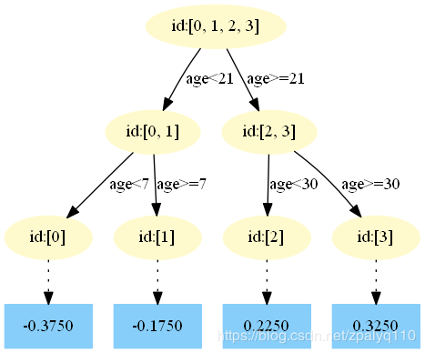
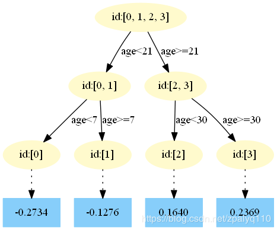
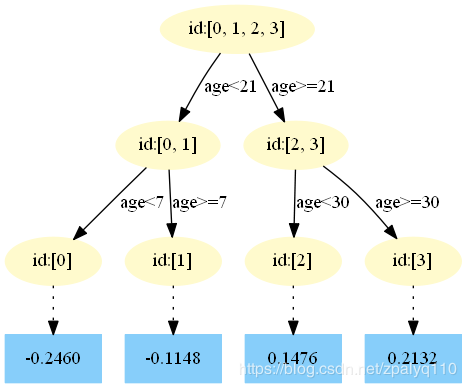

[博客原地址====================](https://blog.csdn.net/zpalyq110/article/details/79527653)

## 1 数据介绍

​	如下表所示：一组数据，特征为年龄、体重，身高为标签值。共有5条数据，前四条为训练样本，最后一条为要预测的样本。

|    编号     | 年龄(岁) | 体重(kg) | 身高(m)(标签) |
| :---------: | :------: | :------: | :-----------: |
|      0      |    5     |    20    |      1.1      |
|      1      |    7     |    20    |      1.3      |
|      2      |    21    |    70    |      1.7      |
|      3      |    30    |    60    |      1.8      |
| 4(要预测的) |    25    |    65    |      ？       |

## 2 训练阶段

- 参数设置
  - 学习率 learning_rate=0.1
  - 迭代次数：n_trees=5
  - 树的深度：max_depth=3

### 2.1 初始化弱学习器：

$$
f_0(x)=argmin\sum_{i=1}^{N}L(y_i,c)
$$

​	损失函数为平方损失，因为平方损失函数是一个凸函数，直接求导，倒数等于零，得到c
c。 
$$
\sum_{i=1}^{N}\frac{∂L(y_i,c)}{∂c}=\sum_{i=1}^{N}\frac{∂(\frac{2}{1}(y_i-c)^2)}{∂c}=\sum_{i=1}^{N}c-y_i\\
令导数等于0\\
\sum_{i=1}^{N}c-y_i=0\\
c=\frac{\sum_{i=1}^{N}y_i}{N}\\
所以初始化是c取值为所有训练样本标签的均值\\
c=\frac{1.1+1.3+1.7+1.8}{4}=1.475\\
此时得到初始学习器f_0(x)\\
f_0(x)=c=1.475
$$

### 2.2 对迭代轮数 m=1, 2, .... m:

​	由于我们设置了迭代次数：n_trees=5 这里 M=5

​	计算负梯度，根据上文损失函数为平方损失时，负梯度就是残差残差，再直白一点就是 y
y与上一轮得到的学习器fm−1 的差值 
$$
r_{i1}=-[\frac{∂L(y_i, f(x_i))}{∂f(x_i)}]_{f(x)=f_0(x)}
$$
残差在下列表出：

| 编号 | 真实值 | f0(x) |  残差  |
| :--: | :----: | :---: | :----: |
|  0   |  1.1   | 1.475 | -0.375 |
|  1   |  1.3   | 1.475 | -0.175 |
|  2   |  1.7   | 1.475 | 0.225  |
|  3   |  1.8   | 1.475 | 0.325  |

此时将残差作为样本的真实值来训练弱学习器f1(x) 即下表数据

| 编号 | 年龄(岁) | 体重(kg) | 标签值 |
| :--: | :------: | :------: | :----: |
|  0   |    5     |    20    | -0.375 |
|  1   |    7     |    20    | -0.175 |
|  2   |    21    |    70    | 0.225  |
|  3   |    30    |    60    | 0.325  |

接着，寻找回归树的最佳划分节点，遍历每个特征的每个可能取值。从年龄特征的5开始，到体重特征的70结束，分别计算分裂后两组数据的平方损失（Square Error），SEl	
 左节点平方损失，SEr 右节点平方损失，找到使平方损失和*S**E**s**u**m*=*S**E**l*+*S**E**r*最小的那个划分节点，即为最佳划分节点。

 例如：以年龄7为划分节点，将小于7的样本划分为到左节点，大于等于7的样本划分为右节点。左节点包括x0  ，右节点包括样本x1,x2,x3  ，SEl=0,SEr=0.140,SEsum=0.140 所有可能划分情况如下表所示：

| 划分点 | 小于划分点的样本 | 大于划分点的样本 |  SEl  |  SEr  |   SEsum   |
| :----: | :--------------: | :--------------: | :---: | :---: | :-------: |
| 年龄5  |        /         |    0, 1, 2, 3    |   0   | 0.327 |   0.327   |
| 年龄7  |        0         |     1, 2, 3      |   0   | 0.140 |   0.140   |
| 年龄21 |       0, 1       |       2, 3       | 0.02  | 0.005 | **0.025** |
| 年龄30 |     0, 1, 2      |        3         | 0.187 |   0   |   0.187   |
| 体重20 |        /         |    0, 1, 2, 3    |   0   | 0.327 |   0.327   |
| 体重30 |        0         |     1, 2 , 3     |   0   | 0.140 |   0.140   |
| 体重60 |       0, 1       |       2, 3       | 0.020 | 0.005 | **0.025** |
| 体重70 |     0, 1, 3      |        2         | 0.260 |   0   |   0.260   |

  以上划分点是的总平方损失最小为**0.025**有两个划分点：年龄21和体重60，所以随机选一个作为划分点，这里我们选 **年龄21**
  现在我们的第一棵树长这个样子：

  我们设置的参数中树的深度max_depth=3，现在树的深度只有2，需要再进行一次划分，这次划分要对左右两个节点分别进行划分：

对于**左节点**，只含有0,1两个样本，根据下表我们选择**年龄7**划分

| 划分点 | 小于划分点样本 | 大于划分点样本 | SEl  |  SEr  | SEsum |
| :----: | :------------: | :------------: | :--: | :---: | :---: |
| 年龄5  |       /        |      0，1      |  0   | 0.020 | 0.020 |
| 年龄7  |       0        |       1        |  0   |   0   | **0** |
| 体重20 |       /        |      0，1      |  0   | 0.020 | 0.020 |
| 体重30 |       0        |       1        |  0   |   0   | **0** |

对于**右节点**，只含有2,3两个样本，根据下表我们选择**年龄30**划分（也可以选**体重70**）

| 划分点 | 小于划分点样本 | 大于划分点样本 | SEl  |  SEr  | SEsum |
| :----: | :------------: | :------------: | :--: | :---: | :---: |
| 年龄21 |       /        |      2，3      |  0   | 0.005 | 0.005 |
| 年龄30 |       2        |       3        |  0   |   0   | **0** |
| 体重60 |       /        |      2，3      |  0   | 0.005 | 0.005 |
| 体重70 |       3        |       2        |  0   |   0   | **0** |

现在我们的第一棵树长这个样子：

此时我们的树深度满足了设置，还需要做一件事情，给这每个叶子节点分别赋一个参数Υ
Υ，来拟合残差。 

Υ*j*1=Υ*a**r**g**m**i**n**x**i*∈*R**j*1∑*L*(*y**i*,*f*0(*x**i*)+Υ)

 这里其实和上面初始化学习器是一个道理，平方损失，求导，令导数等于零，化简之后得到每个叶子节点的参数Υ
Υ，其实就是标签值的均值。这个地方的标签值不是原始的 y
y，而是本轮要拟合的标残差 y−f0(x) 

根据上述划分结果，为了方便表示，规定从左到右为第1,2,3,4 个叶子结点
$$
(x_0∈R_{11}),Υ_{11}=-0.375\\
(x_0∈R_{21}),Υ_{21}=-0.175\\
(x_0∈R_{31}),Υ_{31}=0.225\\
(x_0∈R_{41}),Υ_{41}=0.325\\
$$
此时的树长这个样子：

此时可更新强学习器，需要用到参数学习率：learning_rate=0.1，用lr表示。 
$$
f_1(x)=f_0(x)+lr*\sum_{j=1}^{4}Υ_{j1}I(x∈R_{j1})
$$

为什么要用学习率呢？这是**Shrinkage**的思想，如果每次都全部加上（学习率为1）很容易一步学到位导致过拟合

**重复此步骤，直到 m>5 m>5 结束，最后生成5棵树。 **

- 第一课树

  

- 第二课树

- 第三棵树

- 第四颗树

- 第五课树

### 4.得到最后的强学习器：

$$
f(x)=f_5(x)=f_0(x)+\sum_{m=1}^{5}\sum_{j=1}^{4}Υ_{jm}I(x∈R_{jm})
$$

$$
f_{11}=f_{01}+lr*res_{11}=1.475+0.1*-0.375=1.4375\\
f_{12}=f_{02}+lr*res_{12}=1.475+0.1*-0.175=1.4575\\
f_{13}=f_{03}+lr*res_{13}=1.475+0.1*0.225=1.4975\\
f_{14}=f_{04}+lr*res_{14}=1.475+0.1*0.325=1.5075\\
res_{21}=1.1-f_{11}=1.1-1.4375=-0.3375\\

以此类推。。。
$$

**计算数据表**

|       |    1     |    2     |    3    |    4    |
| :---: | :------: | :------: | :-----: | :-----: |
|   y   |   1.1    |   1.3    |   1.7   |   1.8   |
|  f0   |  1.475   |  1.475   |  1.475  |  1.475  |
| res_1 |  -0.375  |  -0.175  |  0.225  |  0.325  |
|  f1   |  1.4375  |  1.4575  | 1.4975  | 1.5075  |
| res_2 | -0.3375  | -0.1575  | 0.2025  | 0.2925  |
|  f2   | 1.40375  | 1.44175  | 1.51775 | 1.53675 |
| res_3 | -0.30375 | -0.14175 | 0.18225 | 0.26325 |
|  f3   | 1.37338  | 1.42758  | 1.53597 | 1.56307 |
| res_4 | -0.27337 | -0.12757 | 0.16403 | 0.23693 |
|  f4   | 1.34604  | 1.41482  | 1.55238 | 1.58677 |
| res_5 | -0.24604 | -0.11482 | 0.14762 | 0.21323 |
|  f5   | 1.32143  | 1.40334  | 1.56714 | 1.60809 |

### 5 预测样本5

f0(x)=1.475

在f1(x) 中，样本4的年龄为25，大于划分节点21岁，又小于30岁，所以被预测为0.2250。
在f2(x) 中，样本4的…此处省略…所以被预测为0.2025

在f3(x) 中，样本4的…此处省略…所以被预测为0.1823
在f4(x) 中，样本4的…此处省略…所以被预测为0.1640
在f5(x)中，样本4的…此处省略…所以被预测为0.1476 

### 6 最终预测结果

*f*(*x*)=1.475+0.1∗(0.225+0.2025+0.1823+0.164+0.1476)=1.56714

i*=1∑*N*∂*c*∂*L*(*y**i*,*c*))=*i*=1∑*N*∂*c*∂(21(*y**i*−*c*)2)=*i*=1∑*N**c*−