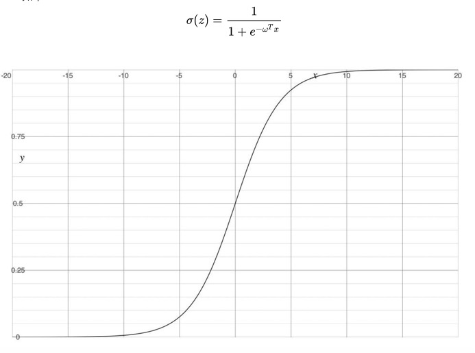
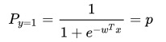
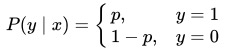
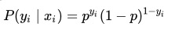
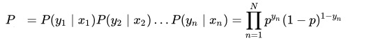
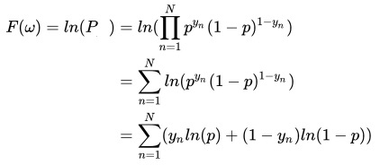

[博客原地址](https://www.jianshu.com/p/0cfabca442d9)

# 逻辑回归
	逻辑回归也是广义上的线性回归

# sigmoid函数

# 逻辑回归的损失函数

当事件结果就只有2个标签时，yn ∈(0,1),把时间发生的概率看作P，那么标签1的概率为：

同理，标签0的概率为 Py=0= 1 - P
所以这个事件发生的概率可以写成

为了方便计算，可以等价于：
	

假设样本是独立同分布的，采用极大似然估计可得

可以通过取对数，来简化计算，此外P是一个只包含 w 一个未知数的函数：

....

[导数的推导 ------ 可以好好看看](https://blog.csdn.net/qq_38923076/article/details/82925183)
