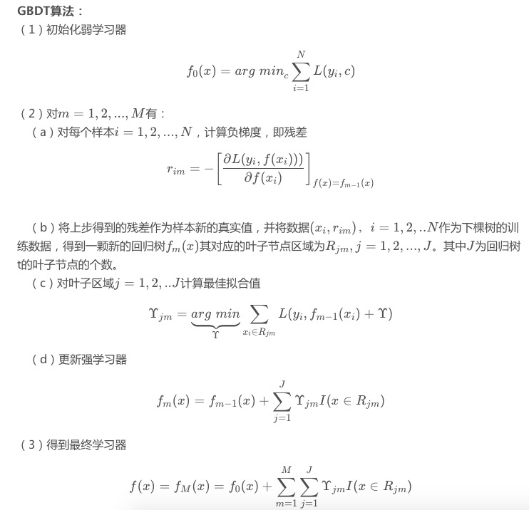

# GBDT

[博客原地址====================](https://blog.csdn.net/zpalyq110/article/details/79527653)

## 1 Decision Tree : CART回归树

  首先，GBDT使用的决策树是CART回归树，无论是处理回归问题还是二分类以及多分类，GBDT使用的决策树通通都是都是CART回归树。为什么不用CART分类树呢？因为GBDT每次迭代要拟合的是梯度值，是连续值所以要用回归树。
  对于回归树算法来说最重要的是寻找最佳的划分点，那么回归树中的可划分点包含了所有特征的所有可取的值。在分类树中最佳划分点的判别标准是熵或者基尼系数，都是用纯度来衡量的，但是在回归树中的样本标签是连续数值，所以再使用熵之类的指标不再合适，取而代之的是平方误差，它能很好的评判拟合程度。

**回归树生成算法**

输入：训练数据集D:
输出：回归树f(x)f(x).
在训练数据集所在的输入空间中，递归的将每个区域划分为两个子区域并决定每个子区域上的输出值，构建二叉决策树：
（1）选择最优切分变量j与切分点s，求解
$$
min_{j,s}[min_{c_1}\sum_{x_i∈R_1(j,s)}(y_i-c_1)^2+min_{c_2}\sum_{x_i∈R_2(j,s)}(y_i-c_2)^2]\\
R_1:分类1的集合\\
R_2:分类2的集合\\
c_1:分类1的均值\\
c_2:分类2的均值\\
j:变量\\
s:切分点，把数据切分成分类1分类2
$$
遍历变量j，对固定的切分变量j扫描切分点ss，选择使得上式达到最小值的对(j,s)
（2）用选定的对(j,s)划分区域并决定相应的输出值：
$$
R_1(j,s)=x|x^{(j)}\leq s,R_2(j,s)=x|x^{(j)}>s\\
c_m=\frac{1}{N}\sum_{x_1∈R_m(j, s)}y_i,x∈R_m, m=1,2
$$
（3）继续对两个子区域调用步骤（1）和（2），直至满足停止条件。

（4）将输入空间划分为M个区域 R1,R2,...RM ，生成决策树：
$$
f(x)=\sum_{m=1}^{M}c_mI(x∈R_m)
$$

 ## 2 Gradient Boosting：负梯度拟合

  梯度提升树（Grandient Boosting）是提升树（Boosting Tree）的一种改进算法，所以在讲梯度提升树之前先来说一下提升树。

  先来个通俗理解：假如有个人30岁，我们首先用20岁去拟合，发现损失有10岁，这时我们用6岁去拟合剩下的损失，发现差距还有4岁，第三轮我们用3岁拟合剩下的差距，差距就只有一岁了。如果我们的迭代轮数还没有完，可以继续迭代下面，每一轮迭代，拟合的岁数误差都会减小。最后将每次拟合的岁数加起来便是模型输出的结果。

**提升树算法**
$$
(1)初始化f_0(x)=0\\
(2)对m=1,2,...,M\\
	（a）计算残差\\
		r_{mi}=y_i-f_{m-1}(x),i=1,2,...,N\\
		(b)拟合残差r_{mi}学习一个回归树，得到h_m(x)\\
		(c)更新f_m(x)=f_{m-1}+h_m(x)\\
(3)得到回归树\\
f_M(x)=\sum_{m=1}^{M}h_m(x)
$$

上面伪代码中的**残差**是什么？
在提升树算法中，假设我们前一轮迭代得到的强学习器是
$$
f_(t-1)(x)
$$
损失函数是
$$
L(y, f_{t-1}(x))
$$
我们本轮迭代的目标是找到一个弱学习器
$$
h_t(x)
$$
最小化让本轮的损失
$$
L(y,f_t(x))=L(y, f_{t-1}(x)+h_t(x))
$$
当采用平方损失函数时
$$
L(y, f_{t-1}(x)+h_t(x))\\
=(y-f_{t-1}(x)-h_t(x))^2\\
=(r-h_t(x))^2
$$
这里
$$
r=y-f_{t-1}(x)
$$
是当前模型拟合数据的残差（residual）所以，对于提升树来说只需要简单地拟合当前模型的残差。
  回到我们上面讲的那个通俗易懂的例子中，第一次迭代的残差是10岁，第二 次残差4岁……

  当损失函数是平方损失和指数损失函数时，梯度提升树每一步优化是很简单的，但是对于一般损失函数而言，往往每一步优化起来不那么容易，针对这一问题，Friedman提出了梯度提升树算法，这是利用最速下降的近似方法，其关键是利用损失函数的负梯度作为提升树算法中的残差的近似值。
那么负梯度长什么样呢？
第t轮的第i个样本的损失函数的负梯度为： 
$$
-[\frac{∂L(y, f(x_i))}{∂f(x_i)}]_{f(x)=f_{i-1}(x)}
$$
此时不同的损失函数将会得到不同的负梯度，如果选择平方损失
$$
L(y, f(x_i))=\frac{1}{2}(y-f(x_1))^2
$$
负梯度为
$$
-[\frac{∂L(y, f(x_i))}{∂f(x_i)}]_{f(x)=f_{i-1}(x)}=y-f(x_i)
$$
此时我们发现GBDT的负梯度就是残差，所以说对于回归问题，我们要拟合的就是残差。
那么对于分类问题呢？二分类和多分类的损失函数都是logloss，本文以回归问题为例进行讲解。 

##  3 GBDT算法原理

  上面两节分别将Decision Tree和Gradient Boosting介绍完了，下面将这两部分组合在一起就是我们的GBDT了。

**GBDT算法**

(1) 初始化弱分类器
$$
f_0(x)=argmin_c\sum_{i=1}^{N}L(y_i,c)
$$
(2) 对M=1,2,...,M有

2a 对样本i=1,2,...,N 计算负梯度，即残差（平方损失函数）
$$
r_{im}=-[\frac{∂L(y, f(x_i))}{∂f(x_i)}]_{f(x)=f_{i-1}(x)}
$$
 

## 3 优缺点

**优点**

- 预测精度高
- 适合低维数据
- 能处理非线性数据
- 可以灵活处理各种类型的数据，包括连续值和离散值。
- 在相对少的调参时间情况下，预测的准备率也可以比较高。这个是相对SVM来说的。
- 使用一些健壮的损失函数，对异常值的鲁棒性非常强。比如 Huber损失函数和Quantile损失函数。

**缺点**

- 由于弱学习器之间存在依赖关系，难以并行训练数据。不过可以通过自采样的SGBT来达到部分并行。
- 如果数据维度较高时会加大算法的计算复杂度

