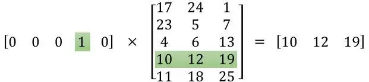

<font size=10>**tf.nn.embedding_lookup函数**</font>





我觉得这张图就够了，实际上tf.nn.embedding_lookup的作用就是找到要寻找的embedding data中的对应的行下的vector。

```python
tf.nn.embedding_lookup(params, ids, partition_strategy=‘mod’, name=None, validate_indices=True, max_norm=None)
"""
- params: 表示完整的嵌入张量，或者除了第一维度之外具有相同形状的P个张量的列表，表示经分割的嵌入张量
- ids: 一个类型为int32或int64的Tensor，包含要在params中查找的id
- partition_strategy: 指定分区策略的字符串，如果len（params）> 1，则相关。当前支持“div”和“mod”。 默认为“mod”
- name: 操作名称（可选）
- validate_indices:  是否验证收集索引
- max_norm: 如果不是None，嵌入值将被l2归一化为max_norm的值
""" 
```


```python
import tensorflow as tf
import numpy as np

a = [[0.1, 0.2, 0.3], [1.1, 1.2, 1.3], [2.1, 2.2, 2.3], [3.1, 3.2, 3.3], [4.1, 4.2, 4.3]]
a = np.asarray(a)
idx1 = tf.Variable([0, 2, 3, 1], tf.int32)
idx2 = tf.Variable([[0, 2, 3, 1], [4, 0, 2, 2]], tf.int32)
out1 = tf.nn.embedding_lookup(a, idx1)
out2 = tf.nn.embedding_lookup(a, idx2)
init = tf.global_variables_initializer()

with tf.Session() as sess:
    sess.run(init)
    print(sess.run(out1))
    print(out1)
    print('==================')
    print(sess.run(out2))
    print(out2)
```

输出：

```python
"""
a:
[[0.1, 0.2, 0.3], 
 [1.1, 1.2, 1.3], 
 [2.1, 2.2, 2.3], 
 [3.1, 3.2, 3.3], 
 [4.1, 4.2, 4.3]]
 
idx1 [0, 2, 3, 1]

out1: (对应 a 的 第0，2，3，1 行)
[[ 0.1  0.2  0.3]
 [ 2.1  2.2  2.3]
 [ 3.1  3.2  3.3]
 [ 1.1  1.2  1.3]]
 
"""


[[ 0.1  0.2  0.3]
 [ 2.1  2.2  2.3]
 [ 3.1  3.2  3.3]
 [ 1.1  1.2  1.3]]
Tensor("embedding_lookup:0", shape=(4, 3), dtype=float64)
==================
[[[ 0.1  0.2  0.3]
  [ 2.1  2.2  2.3]
  [ 3.1  3.2  3.3]
  [ 1.1  1.2  1.3]]

 [[ 4.1  4.2  4.3]
  [ 0.1  0.2  0.3]
  [ 2.1  2.2  2.3]
  [ 2.1  2.2  2.3]]]
Tensor("embedding_lookup_1:0", shape=(2, 4, 3), dtype=float64)
```

